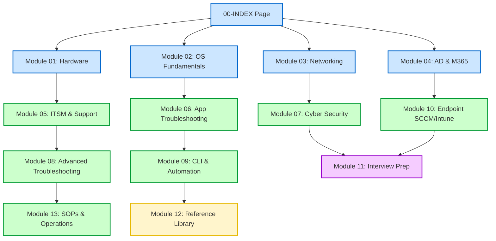

# 00-INDEX — DSE Master Vault Navigation

> [!abstract] Overview
> Welcome to the DSE Master Vault. This is the master control and navigation center of your study guide. Use this file to navigate between modules, cheat sheets, and SOPs.

---

## What Is It? (Concept Explanation)
This index acts like the GPS or blueprint of your learning journey. 
*Simple shabdon mein bolein toh: Yeh pure study vault ka map hai. Yahan se aap kisi bhi module, topic, ya SOP par direct jump kar sakte hain.*

---

## How It Works (Deep Dive)
Below is the logical structure of the DSE Master Vault modules. Click on any link to navigate to the respective study guide.

Below is the complete module structure. Click on any link to navigate to the respective study guide.

### 🗺️ Navigation & Tracking (Module 00)
- [[00-Study-Roadmap|30/60/90 Day Learning Plan]]
- [[00-Certification-Tracker|CompTIA A+ & ITIL Tracker]]
- [[00-Daily-Log-Template|Daily Learning & Support Log Template]]
- [[00-Virtual-Lab-Setup-Guide|Virtual Lab Setup Guide (Practice Environment)]]

### 🔌 Module 01: Hardware Fundamentals
- [[01-01 Computer Architecture Overview]]
- [[01-02 CPU Deep Dive]]
- [[01-03 RAM & Memory]]
- [[01-04 Storage Devices]]
- [[01-05 Motherboard & BIOS]]
- [[01-06 Power Supply Unit]]
- [[01-07 Display & Monitors]]
- [[01-08 Peripheral Devices]]
- [[01-09 Laptop-Specific Support]]
- [[01-10 Hardware Troubleshooting Masterclass]]
- [[01-11 Hardware Cheat Sheet]]

### 🖥️ Module 02: Operating Systems
- [[02-01 Windows Architecture Overview]]
- [[02-02 Windows Installation & Deployment]]
- [[02-03 Windows Registry]]
- [[02-04 Windows Services & Processes]]
- [[02-05 Group Policy (GPO)]]
- [[02-06 Windows Event Viewer]]
- [[02-07 Windows Update & Patching]]
- [[02-08 User Profiles & Account Management]]
- [[02-09 Windows Security & Defender]]
- [[02-10 System Recovery Tools]]
- [[02-11 Linux Basics for Desktop Support]]
- [[02-12 macOS Basics for Support]]
- [[02-13 OS Troubleshooting Masterclass]]

### 🌐 Module 03: Networking for Desktop Support
- [[03-01 OSI Model (The Complete Guide)]]
- [[03-02 IP Addressing & Subnetting]]
- [[03-03 Core Network Protocols]]
- [[03-04 Network Ports Master Reference]]
- [[03-05 Network Hardware]]
- [[03-06 Wi-Fi Troubleshooting Deep Dive]]
- [[03-07 VPN for Desktop Support]]
- [[03-08 Network Diagnostic Commands]]
- [[03-09 Proxy & Firewall Basics]]
- [[03-10 Networking Cheat Sheet]]

### 🏢 Module 04: Active Directory & M365
- [[04-01 Active Directory Fundamentals]]
- [[04-02 User Account Management in AD]]
- [[04-03 Group Management]]
- [[04-04 Computer Account Management]]
- [[04-05 Group Policy for Support Engineers]]
- [[04-06 Microsoft 365 Admin Center]]
- [[04-07 Exchange & Outlook Administration Basics]]
- [[04-08 Microsoft Teams Administration]]
- [[04-09 Azure AD Basics (Hybrid Environment)]]

### 🎟️ Module 05: Help Desk, ITSM & Soft Skills
- [[05-01 ITIL v4 Foundation for Support Engineers]]
- [[05-02 Incident Management]]
- [[05-03 Problem Management]]
- [[05-04 Change Management]]
- [[05-05 Ticketing Systems]]
- [[05-06 Remote Support Tools]]
- [[05-07 Communication Skills for Support]]
- [[05-08 Documentation & Knowledge Base]]
- [[05-09 SLA Management & Reporting]]

### 📦 Module 06: Software & Application Support
- [[06-01 Microsoft Office 365 Troubleshooting]]
- [[06-02 Outlook Deep Dive Troubleshooting]]
- [[06-03 Microsoft Teams Troubleshooting]]
- [[06-04 Browser Troubleshooting]]
- [[06-05 Software Installation & Management]]
- [[06-06 Printer & Printing Support]]
- [[06-07 VoIP & Softphone Support]]
- [[06-08 Application Error Analysis]]

### 🛡️ Module 07: Cybersecurity for Support
- [[07-01 Security Fundamentals (CIA Triad)]]
- [[07-02 Malware Types & Response]]
- [[07-03 Antivirus & Endpoint Security]]
- [[07-04 Phishing & Social Engineering]]
- [[07-05 Encryption & Data Protection]]
- [[07-06 Password Security & MFA]]
- [[07-07 Windows Firewall & Network Security]]
- [[07-08 Security Incident Response]]

### 🔍 Module 08: Advanced Troubleshooting
- [[08-01 The Professional Troubleshooting Methodology]]
- [[08-02 BSOD (Blue Screen of Death) Analysis]]
- [[08-03 Slow PC Diagnosis & Optimization]]
- [[08-04 System File & Disk Repair]]
- [[08-05 Boot Issues Troubleshooting]]
- [[08-06 Network Connectivity Troubleshooting]]
- [[08-07 Performance Monitoring Tools]]
- [[08-08 Sysinternals Suite for Support Engineers]]

### ⚙️ Module 09: Command Line & Automation
- [[09-01 CMD Masterclass for Desktop Support]]
- [[09-02 PowerShell for Desktop Support]]
- [[09-03 Useful PowerShell Scripts for Support]]
- [[09-04 Batch Scripting Basics]]
- [[09-05 Remote Management Commands]]

### 📡 Module 10: Endpoint Management (SCCM/Intune)
- [[10-01 SCCM Basics for Desktop Support]]
- [[10-02 Microsoft Intune Basics]]
- [[10-03 Windows Autopilot]]
- [[10-04 Asset Management]]

### 💼 Module 11: Interview Preparation
- [[11-01 Top 100 Desktop Support Interview Q&A]]
- [[11-02 Common Interview Scenarios]]
- [[11-03 Resume Writing for Desktop Support]]
- [[11-04 Certifications Roadmap]]
- [[11-05 Salary Negotiation & Career Growth]]

### 📚 Module 12: Quick Reference Library
- [[12-01 Windows Keyboard Shortcuts (Complete)]]
- [[12-02 CMD & PowerShell Commands Cheat Sheet]]
- [[12-03 Network Ports Reference Table]]
- [[12-04 Common Error Codes & Fixes]]
- [[12-05 BSOD Stop Codes Reference]]
- [[12-06 Event Viewer IDs Reference]]
- [[12-07 HTTP Status Codes]]
- [[12-08 Printer Error Codes Reference]]
- [[12-09 IP Subnetting Quick Reference]]
- [[12-10 Acronyms & Glossary]]

### 📋 Module 13: Daily Operations & SOPs
- [[13-01 New User Onboarding SOP]]
- [[13-02 New PC Setup & Imaging SOP]]
- [[13-03 PC Replacement - Refresh SOP]]
- [[13-04 Password Reset SOP]]
- [[13-05 Malware Incident Response SOP]]
- [[13-06 Printer Setup SOP (Local & Network)]]
- [[13-07 VPN Access Request & Troubleshooting SOP]]
- [[13-08 User Offboarding SOP]]
- [[13-09 Shift Handover Checklist]]
- [[13-10 End-of-Day - Weekly Maintenance Checklist]]

---

## Real-World Scenarios
**Scenario 1:** A junior engineer joins the team and wants a single directory to find troubleshooting steps.
- Solution: Open the `00-INDEX.md` file in Obsidian to access everything from one interface.

---

## Step-by-Step Troubleshooting Guide
1. If a link doesn't work, ensure the corresponding file exists in the directory.
2. In Obsidian, hover over internal links with the `Ctrl` key pressed to preview.

---

## Important Commands / Shortcuts
Use `Ctrl + O` in Obsidian to quickly find and open any note listed here.

---

## Common Mistakes to Avoid
> [!warning] Watch Out
> - Modifying note filenames directly in Windows Explorer can break the internal link references inside the index. Always rename notes from within Obsidian.

---

## SOP (Standard Operating Procedure)
- [ ] Open DSE Master Vault in Obsidian.
- [ ] Pin `00-INDEX.md` to your left sidebar.
- [ ] Use the search bar to locate specific tags like `#networking` or `#active-directory`.

---

## Pro Tips (Senior Engineer Secrets)
> [!tip] From the Field
> Set Obsidian's default view to "Preview Mode" for the index file so it behaves like an interactive wiki page.

---

## Quick Revision Summary
| # | Key Point | One-Line Explanation |
|---|-----------|----------------------|
| 1 | Centralized Map | Use `00-INDEX` as the primary navigation file. |
| 2 | Modular Learning | Go step-by-step from Module 01 onwards. |
| 3 | Reference SOPs | Refer to Module 13 for daily task instructions. |

---

## Interview Q&A Bank
**Q1: How do you organize your technical documentation on the job?**
A: I maintain a localized wiki (like Obsidian or OneNote) using structured tags and modules to quickly retrieve command lines, error codes, and SOP checklists during support calls.

---

## Related Notes
- [[00-Study-Roadmap]] — Study timelines
- [[00-Certification-Tracker]] — Cert goals

---

## Study Resources
- [Obsidian Official Help Guide](https://help.obsidian.md)