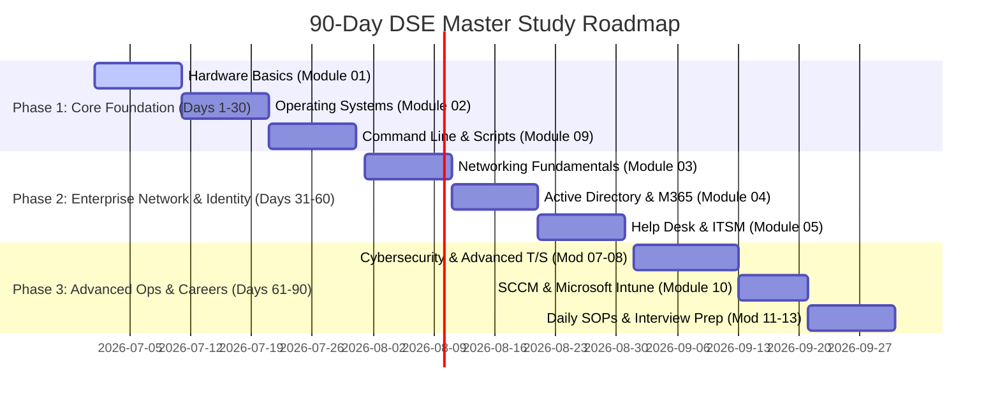

# 00-Study-Roadmap

> [!abstract] Overview
> A detailed 30-60-90 Day study roadmap to master Desktop Support Engineering from basic hardware support to advanced endpoint management and ITIL v4 standards. This roadmap includes milestones, weekly schedules, expected outcomes, and direct links to vault study modules.

---

## Introduction: Training for Enterprise Readiness
This roadmap is structured to take you from a complete beginner (zero knowledge) to an enterprise-ready Desktop Support Engineer capable of troubleshooting complex corporate environments, passing CompTIA A+ and ITIL v4, and handling modern endpoint configurations.
*Seedha simple shabdon mein bole toh: Yeh 90 days ka plan hai. Pehle 30 din mein aap hardware aur local Windows OS seekhenge, agle 30 din mein networking, Active Directory aur Office 365, aur aakhri 30 din mein enterprise level tools like SCCM, Intune, Cybersecurity, aur Interview Prep par focus karenge.*

---

## Visual Roadmap Timeline

---

## Detailed Study Phases

### Phase 1: Core Hardware & Operating Systems (Days 1 to 30)
**Goal:** Master physical PC architecture, OS administration, and local command line scripting.
- **Week 1: Physical Hardware Components**
  - Study CPU architecture, RAM configurations, Storage types (NVMe/SATA), and Motherboards.
  - Review bios configurations, UEFI settings, and hardware boot priorities.
  - *Relevant Modules:* [[01-01 Computer Architecture Overview]] to [[01-07 BIOS & UEFI Configuration]].
- **Week 2: Peripherals, Laptops & Basic Troubleshooting**
  - Understand laptop components, display panels, peripheral connections, and initial power issues.
  - Master troubleshooting bios beep codes.
  - *Relevant Modules:* [[01-08 Peripheral Devices]] to [[01-11 Hardware Cheat Sheet]].
- **Week 3: Windows OS Administration & File Systems**
  - Deep dive into Windows directories, Registry configurations, Local Services, and User Accounts.
  - Learn Windows Event Viewer navigation and patch management cycles.
  - *Relevant Modules:* [[02-01 Windows Architecture]] to [[02-08 User Profiles & Account Management]].
- **Week 4: Command Line, Scripting, and OS Recovery**
  - Practice using CMD commands (`ipconfig`, `sfc /scannow`, `chkdsk`, `gpupdate`).
  - Learn basic PowerShell cmdlets for task automation.
  - Study OS recovery options, Linux/macOS basics, and troubleshooting boot loops.
  - *Relevant Modules:* [[09-01 CMD Masterclass for Desktop Support]] to [[09-05 Remote Management Commands]], and [[02-09 Windows Security & Defender]] to [[02-13 OS Troubleshooting Masterclass]].

---

### Phase 2: Enterprise Network, Identity, & ITIL (Days 31 to 60)
**Goal:** Understand how computers communicate in corporate networks, how corporate users are managed, and standard ticket workflows.
- **Week 5: Networking & Communications**
  - Study TCP/IP, OSI model layers, IP Subnetting, and essential network ports.
  - Master configuring wired LAN vs. Wi-Fi connections and setting static IPs.
  - Learn to debug DNS resolving issues, DHCP lease allocation, and VPN issues.
  - *Relevant Modules:* [[03-01 OSI Model & TCP-IP Suite]] to [[03-10 Networking Cheat Sheet]].
- **Week 6: Active Directory & Hybrid Identity**
  - Learn Active Directory domain concepts, domain controllers, organizational units (OUs), and trust structures.
  - Perform user onboarding tasks: creating accounts, resetting passwords, and adjusting group memberships.
  - *Relevant Modules:* [[04-01 Active Directory Fundamentals]] to [[04-04 Computer Account Management]].
- **Week 7: Microsoft 365, Exchange, and Teams Administration**
  - Manage licenses in M365 Admin Center.
  - Configure mailboxes, distribution lists, shared mailboxes, and Outlook profiles.
  - Troubleshoot Microsoft Teams connectivity, audio/video devices, and caching.
  - *Relevant Modules:* [[04-06 Microsoft 365 Admin Center]] to [[04-09 Azure AD Basics (Hybrid Environment)]].
- **Week 8: ITIL v4 framework & Help Desk Management**
  - Understand Incident vs. Problem vs. Change management.
  - Master Ticket Priority Matrices (Impact vs. Urgency), SLAs, Escalations, and Remote Control guidelines.
  - *Relevant Modules:* [[05-01 ITIL v4 Foundation for Support Engineers]] to [[05-09 SLA Management & Reporting]].

---

### Phase 3: Security, Endpoints, SOPs & Career Prep (Days 61 to 90)
**Goal:** Secure client environments, manage software, learn enterprise device management platforms, and clear job interviews.
- **Week 9: Software Troubleshooting, Printers, and Security**
  - Troubleshoot print spoolers, map network printers, and resolve PDF/Office issues.
  - Learn malware identification, phishing response protocols, security updates, and MFA setup.
  - *Relevant Modules:* [[06-01 Microsoft Office Suite Support]] to [[06-08 Application Error Analysis]], and [[07-01 Security Fundamentals (CIA Triad)]] to [[07-08 Security Incident Response]].
- **Week 10: Advanced Troubleshooting & Endpoint Management**
  - Debug BSODs using WinDbg, analyze Sysinternals logs, and fix startup loops.
  - Learn enterprise deployments: SCCM hierarchy, Intune enrollment, and Windows Autopilot configurations.
  - *Relevant Modules:* [[08-01 The Professional Troubleshooting Methodology]] to [[08-08 Sysinternals Suite for Support Engineers]], and [[10-01 SCCM Basics for Desktop Support]] to [[10-04 Asset Management]].
- **Week 11: Real-World SOPs & Cheat Sheets**
  - Memorize daily operational workflows: New User onboarding SOP, PC provisioning, and shift handover routines.
  - Keep key reference tables close for commands and port configurations.
  - *Relevant Modules:* [[13-01 New User Onboarding SOP]] to [[13-10 End-of-Day - Weekly Maintenance Checklist]], and [[12-01 Windows Keyboard Shortcuts (Complete)]] to [[12-10 Acronyms & Glossary]].
- **Week 12: Interview Preparation & Certifications Tracker**
  - Go through the Top 100 Desktop Support Interview Q&A.
  - Complete mock interview scenarios, refine IT resume layouts, plan certifications, and review salary structures.
  - *Relevant Modules:* [[11-01 Top 100 Desktop Support Interview Q&A]] to [[11-05 Salary Negotiation & Career Growth]].

---

## Success Milestones & Self-Assessment
To track your readiness, check these milestones once completed:
- [ ] **Milestone 1:** Can disassemble/assemble a PC, explain components, and resolve BIOS/UEFI boot loop issues. (Target: Day 15)
- [ ] **Milestone 2:** Can ping devices, explain DNS lookup, configure static IPs, and troubleshoot VPN connections. (Target: Day 40)
- [ ] **Milestone 3:** Can create AD users, reset passwords, map GPOs, and manage mailboxes in Microsoft 365 Admin Center. (Target: Day 55)
- [ ] **Milestone 4:** Can resolve Windows BSODs, configure a device via Intune/Autopilot, and write a batch script for deployment. (Target: Day 75)
- [ ] **Milestone 5:** Completed 100+ Interview Questions practice and completed IT resume template. (Target: Day 90)

---

## Related Notes
- [[00-INDEX]] - Main entrypoint to all modules
- [[00-Virtual-Lab-Setup-Guide]] - Virtual testing environment setup
- [[11-01 Top 100 Desktop Support Interview Q&A]] - Core interview guide