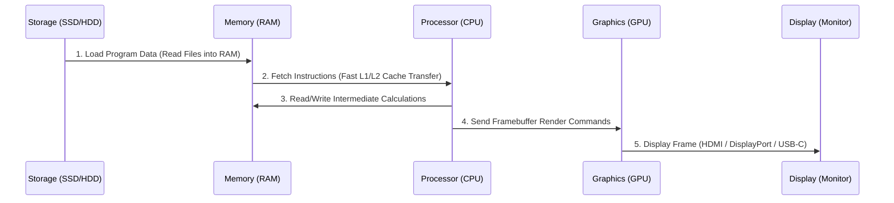

# 01-01 Computer Architecture Overview

> [!abstract] Overview
> A detailed technical breakdown of enterprise computer architecture. This note explains how core system components—CPU, RAM, Storage (SSD/HDD), Chipset, Motherboard, and GPU—cooperate to load, process, and display data for the end-user.

---

## Concept Explanation: The Enterprise Hardware Ecosystem
Computer architecture defines the structural relationships and hardware specifications that govern how instructions are processed. 
*Seedha simple shabdon mein bole toh: Jaise ek business office mein files store karne ke liye Almirah (Storage) hoti hai, files par kaam karne ke liye ek Desk (RAM) hoti hai, aur file par physical decisions lene wala Manager (CPU) hota hai, waise hi computer hardware data ko system mein load, process aur execute karta hai.*

Understanding how these parts interact is critical. When a system is slow or failing to boot, knowing the data path lets you isolate the exact point of failure.

---

## System Components Interaction (Deep Dive)
Every user action, from launching an Excel spreadsheet to rendering an Outlook window, triggers a standardized hardware execution loop:



1. **Storage (NVMe SSD / SATA SSD / HDD):** Stores the operating system binaries, applications, and user files permanently. When not powered, data remains safe.
2. **RAM (Random Access Memory):** The high-speed workspace. The OS copies application code from the slow SSD to the ultra-fast RAM so the CPU can execute it without waiting. RAM is volatile; turning off power wipes its contents.
3. **CPU (Central Processing Unit):** The execution brain. It retrieves instructions from RAM, decodes them, performs calculations using its Arithmetic Logic Unit (ALU), and manages data registers.
4. **Chipset & Motherboard:** The communications system. The system bus (Northbridge/Southbridge or unified modern CPU system buses like PCIe and DMI) transfers data between components.
5. **GPU (Graphics Processing Unit):** Takes raw coordinates and texture structures from the CPU and renders them into pixels, outputting a video signal to the display device.

---

## Real-World Desktop Support Scenarios

### Scenario 1: The Out-Of-Memory Bottleneck
- **Incident Description:** A financial analyst complains that their computer slows to a crawl and displays "Low Memory" alerts when working with large Excel workbooks, while simultaneously running Microsoft Teams and Chrome with 30 tabs open.
- **Troubleshooting Steps:**
  1. Open Windows Task Manager (`Ctrl + Shift + Esc`) and navigate to the **Performance** tab, then select **Memory**.
  2. Notice that memory usage is at 98% (e.g., 7.8 GB of 8 GB in use).
  3. Observe that "In Use (Compressed)" and "Commit Charge" are high, and the disk active time for the system drive is at 100% (indicating active paging/virtual memory swap activity).
  4. Explain to the user that when RAM runs out, Windows uses the SSD as virtual memory (Pagefile.sys), which is 10 to 50 times slower than physical RAM.
- **Resolution:** Upgrade the workstation RAM from 8GB to 16GB (or 32GB) using matching SODIMM/UDIMM modules, enabling dual-channel operation.

---

## Step-by-Step Diagnostic Matrix
When diagnosing system failures, use this hardware validation checklist:

| Test Step | Action | Expected Result | Failure Indicator & Root Cause |
|---|---|---|---|
| **1. Power Verification** | Plug in system power cord, verify PSU switch is set to ON (I), and press the power button. | Power LED lights up, chassis fans spin, and CPU cooler runs. | No light/spin: Faulty power outlet, bad power cable, or blown Power Supply Unit (PSU). |
| **2. POST Verification** | Listen for BIOS beep alerts or observe diagnostic LEDs on the motherboard during boot. | A single short beep, indicating a successful Power-On Self-Test (POST). | Continuous beeps or error LED code: Motherboard failed to detect CPU, RAM, or Graphics card. Refer to motherboard manual. |
| **3. Display Output** | Verify video cables (HDMI/DisplayPort) are connected directly to the dedicated GPU (not onboard port if disabled). | BIOS splash screen displays, followed by Windows logo. | Blank screen: Loose video cable, wrong input source selected on monitor, or faulty GPU. |
| **4. Disk Detection** | Enter BIOS/UEFI utility (using F2/Del keys during boot) and check storage device lists. | Storage device (e.g., Samsung NVMe 512GB) is detected on PCIe M.2 slot 1. | Device not found: Loose SATA cable, unseated M.2 drive, or dead SSD controller. |

---

## Essential Commands & Tools
Run these commands in Windows Command Prompt (CMD) or PowerShell to query hardware specifications without opening the physical chassis:

```cmd
:: Get Total Physical Memory in bytes (CMD)
wmic computersystem get totalphysicalmemory

:: Get detailed memory slot information (CMD)
wmic memorychip get devicelocator, capacity, speed, manufacturer

:: Query motherboard details (PowerShell)
Get-CimInstance -ClassName Win32_BaseBoard | Select-Object Manufacturer, Product, SerialNumber
```

---

## Common Hardware Mistakes to Avoid
> [!warning] ESD Risks and Installation Pitfalls
> - **Ignoring Electrostatic Discharge (ESD):** Working inside a system chassis without using an ESD wrist strap or touching a grounded metal frame can cause micro-damage to semiconductor components. This damage may cause intermittent system crashes months later.
> - **Connecting Monitors to Onboard Ports:** Installing a dedicated graphics card but connecting the monitor cable to the motherboard's onboard video port. This disables high-performance rendering, forcing the CPU to handle display outputs.

---

## Standard Operating Procedure (SOP): Hardware Diagnostics
1. **Prepare Workspace:** Clear the testing area, wear an ESD wrist strap connected to a grounded chassis point, and power down the workstation completely.
2. **Isolate Minimum Bootable Configuration:** If a system fails to POST, strip it down to the absolute essentials: Motherboard, CPU (with cooler), one stick of RAM in Slot 1, and the PSU.
3. **Power On and Listen:** Trigger the power switch. If the system POSTs successfully in this minimum state, add components (second RAM stick, GPU, storage drives) one-by-one to isolate the faulty part.
4. **Update Logs:** Document the Serial Number of any failed parts, initiate an RMA replacement process, and log the maintenance action in the CMDB.

---

## Related Notes
- [[01-02 CPU Deep Dive]] - Detailed processor troubleshooting
- [[01-03 RAM & Memory]] - Memory modules configurations
- [[01-10 Hardware Troubleshooting Masterclass]] - Master debugging guide