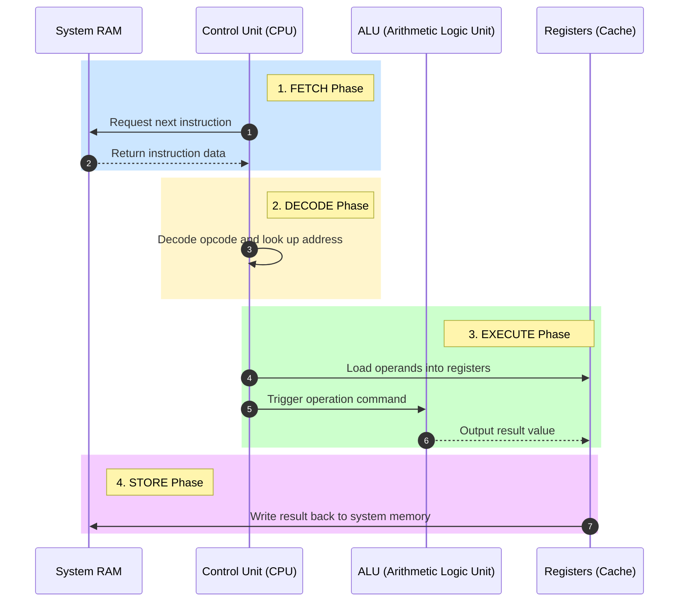

# 01-02 CPU Deep Dive

> [!abstract] Overview
> Deep dive into CPU metrics, physical architecture, thermal troubleshooting, and diagnosis of throttling or overheating in enterprise environments.

---

## What Is It? (Concept Explanation)
The CPU (Central Processing Unit) is the primary processing core of any workstation.



The CPU (Central Processing Unit) is the primary processing core of any workstation.
*Seedha simple shabdon mein: CPU computer ka dimag hai. Sabhi calculations aur instructions yahin run hoti hain. Agar CPU overheat hoga, toh computer apne aap ko bachane ke liye speed slow kar dega (Throttling) ya direct shut down ho jayega (Thermal Shutdown).*

---

## How It Works (Deep Dive)
- **Clock Speed:** The speed at which a CPU executes instructions, measured in Gigahertz (GHz).
- **Cores & Threads:** Cores are physical independent processing units. Threads are virtual pathways (Hyper-Threading / SMT) that allow a core to process two tasks at once.
- **Thermal Design Power (TDP):** The maximum amount of heat a CPU is expected to generate under workload, measured in Watts.
- **CPU Sockets:** Connects the CPU to the motherboard.
    - **LGA (Land Grid Array):** Pins are on the motherboard socket (Intel standard).
    - **PGA (Pin Grid Array):** Pins are on the CPU chip itself (Older AMD standards).

---

## Real-World Scenarios
**Scenario 1:** A user complains their system runs fine for 10-15 minutes, then becomes extremely laggy and eventually turns off without warning.
- Problem: Sudden shutdowns and thermal lag.
- Root Cause: Dried thermal paste and dust buildup in the CPU fan heatsink, triggering a thermal shutdown.
- Solution: Clean the heatsink with compressed air, clean the old thermal paste with Isopropyl Alcohol, and reapply a pea-sized drop of new thermal paste.

**Scenario 2:** A virtual machine running on a developer's workstation is extremely slow and struggling to compile code.
- Problem: Slow VM performance.
- Root Cause: VM core allocation is insufficient. The workstation has an 8-core CPU, but the VM was only allocated 1 vCPU core.
- Solution: Increase vCPU assignment in VMware/Hyper-V settings to 4 vCPUs.

---

## Step-by-Step Troubleshooting Guide
1. **Identify Boot Success:** If the system turns on but displays "CPU Fan Error," verify the fan is plugged into the `CPU_FAN` header on the motherboard, not `SYS_FAN`.
2. **Audit Temperature:** Run HWMonitor or check BIOS system health. CPU idle temperature should be between 35°C and 50°C. If it exceeds 90°C under load, it's overheating.
3. **Verify Power Settings:** Check the Windows Power Plan. If set to "Power Saver," CPU speed may be throttled. Change it to "Balanced" or "High Performance."
4. **Reseat CPU:** If the system fails to POST with 5 beeps (on AMI BIOS), power down, remove the CPU cooler, verify no pins are bent, and reseat the CPU in the socket.

---

## Essential CMD Commands for CPU Diagnostics
```cmd
:: Check CPU name, cores, logical processors, and max clock speed
wmic cpu get name, numberofcores, numberoflogicalprocessors, maxclockspeed

:: Check current CPU speed (useful to detect throttling)
wmic cpu get currentclockspeed

:: Check CPU load via command line
wmic cpu get loadpercentage

:: Check CPU temperature via PowerShell (requires administrator mode)
Get-WmiObject MSAcpi_ThermalZoneTemperature -Namespace "root/wmi"
```

---

## Common Mistakes Desktop Support Engineers Make
> [!warning] Avoid These Mistakes
> - **Blowing dust with mouth:** Adds saliva moisture, leading to corrosion and short circuits. Use compressed air cans only.
> - **Touching CPU pins with bare fingers:** Skin oils can corrode gold pins. Always handle the CPU by its edges.
> - **Applying too much thermal paste:** Excess paste spills onto motherboard components and acts as an insulator rather than a conductor. Pea-sized amount only.
> - **Running stress test without monitoring temperature:** Can burn out the CPU if the cooling system is failing. Always run a monitor side-by-side.

---

## SOP (Standard Operating Procedure)
- [ ] Shut down the computer, unplug the power cord, and press the power button for 10 seconds to drain static.
- [ ] Open the case and disconnect the CPU fan connector.
- [ ] Remove the CPU heatsink/fan assembly carefully.
- [ ] Use Isopropyl Alcohol (90%+) and lint-free wipes to clean old thermal paste.
- [ ] Apply a fresh pea-sized dot of thermal paste in the center of the CPU lid.
- [ ] Mount the heatsink back, tightening screws in a diagonal cross-pattern (X-pattern).
- [ ] Connect the fan cable back to the `CPU_FAN` header, boot the system, and verify temperatures.

---

## Pro Tips (From Senior Engineers)
> [!tip] Field Secrets
> - **BIOS Turbo Boost check:** If the CPU feels sluggish under heavy compiling, check if "Intel Turbo Boost" or "AMD Precision Boost" has been disabled in the BIOS.
> - **Throttling under battery:** Laptop CPUs throttle down aggressively on battery power. Always run diagnostic benchmarks while plugged into AC power.

---

## Quick Revision Summary
| # | Concept | Remember This |
|---|---------|---------------|
| 1 | CPU Temperature | Above 90°C = problem, above 100°C = thermal shutdown |
| 2 | 100% CPU Usage | Check Task Manager, identify service process, stop or restart |
| 3 | Beep Codes | 5 beeps (AMI) = CPU error, reseat CPU |
| 4 | Socket Types | LGA (Intel) has socket pins; PGA (AMD) has chip pins |
| 5 | Thermal Paste | Pea-sized dot in the center; do not spread manually |

---

## Interview Questions & Model Answers
**Q1: User calls saying PC keeps shutting down randomly. How do you troubleshoot?**
A: I suspect a thermal shutdown first. I would check the Event Viewer System logs for Event ID 41 (Kernel-Power) or unclean shutdown codes. I would run a temperature monitor like HWMonitor. If the CPU idle temperature is above 85°C, I would schedule an on-site visit to clean the dust, check the fan speed, and reapply thermal paste.

**Q2: What is the difference between CPU cores and threads?**
A: A core is the physical processor on the silicon die (a physical worker). A thread is a logical queue created by technologies like Hyper-Threading (a virtual worker). One core can handle two threads. For instance, a 4-core CPU with Hyper-Threading has 8 logical processors, improving multitasking.

**Q3: You notice svchost.exe using 50% CPU constantly. What do you do?**
A: `svchost.exe` hosts Windows background services. In Task Manager, I would right-click the process and click "Go to Services" to find which service (e.g., Windows Update, Defender) is looping. If the service is corrupted, I would restart it or clear its cache. I would also verify the executable path is in `System32` to rule out masquerading malware.

---

## Related Notes
- [[01-03 RAM & Memory]] — RAM works with CPU for execution speeds
- [[01-05 Motherboard & BIOS]] — CPU socket sits on the motherboard
- [[08-03 Slow PC Diagnosis & Optimization]] — Diagnosing CPU usage spikes
- [[12-02 CMD & PowerShell Commands Cheat Sheet]] — CMD syntax cheatsheet

---

## Study Resources
- [Microsoft Learn: CPU Performance Counters](https://learn.microsoft.com)
- YouTube: Professor Messer CompTIA A+ Core 1 CPU tutorials.