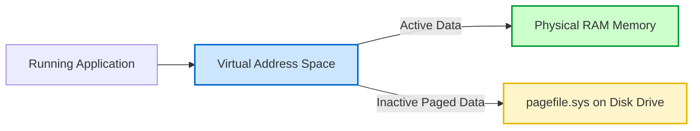

# 01-03 RAM & Memory

> [!abstract] Overview
> Complete guide to RAM configurations, DDR generations, dual-channel setups, diagnosing memory failures using MemTest86, and Windows memory allocation.

---

## What Is It? (Concept Explanation)
System RAM (Random Access Memory) is fast, volatile memory used to store active files.



RAM (Random Access Memory) is volatile high-speed temporary storage used by the OS and active programs.
*Seedha simple shabdon mein: RAM aapka office desk space hai. Jitna bada desk space (RAM) hoga, aap utni hi files (programs) ek sath open karke kaam kar sakenge. Agar desk space bhar gaya, toh kaam slow ho jayega kyunki system disk se data swap karega.*

---

## How It Works (Deep Dive)
- **DDR Generations:** DDR3, DDR4, and DDR5 are the primary RAM interfaces. Each generation has unique key notches to prevent inserting incompatible sticks into motherboard slots.
- **Dual-Channel vs. Single-Channel:** Dual-channel configuration uses two identical memory channels to double the memory bus speed. Requires placing RAM sticks in specific slots (often slots 2 and 4).
- **SO-DIMM vs. UDIMM:** SO-DIMMs are compact memory form factors used in laptops and mini PCs, while UDIMMs are standard unbuffered DIMMs used in desktop motherboards.
- **Virtual Memory / Pagefile:** A reserved section of storage space on the hard drive/SSD that Windows uses as RAM when system memory is fully exhausted.

---

## Real-World Scenarios
**Scenario 1:** A user's PC randomly crashes with a Blue Screen of Death showing error stop code `MEMORY_MANAGEMENT` or `PAGE_FAULT_IN_NONPAGED_AREA`.
- Problem: Random system crashes under workload.
- Root Cause: A damaged memory address block on one of the RAM sticks.
- Solution: Run Windows Memory Diagnostic. If errors are found, run MemTest86 to isolate the failed RAM stick and replace it.

**Scenario 2:** An engineer installs a new 8GB RAM stick on a user's PC that already has an 8GB stick, but Task Manager reports only 8GB is usable, or the system fails to POST.
- Problem: Upgraded memory is not recognized.
- Root Cause: The RAM sticks are running at mismatched speeds/timings, or the second stick is not seated properly in the slot.
- Solution: Reseat the RAM module. Ensure the clips on both sides click into place. If it still fails, boot to BIOS and check if both sticks are detected.

---

## Step-by-Step Troubleshooting Guide
1. **Identify POST Errors:** If the PC turns on but does not boot and emits repeated beep codes (usually 3 long beeps or continuous beep patterns depending on BIOS), RAM is not detected.
2. **Perform Physical Clean:** Power off the PC, remove the RAM sticks, clean the golden contacts with a soft rubber eraser to remove oxidation, blow dust from slots, and reseat the modules.
3. **Isolate Modules:** If you have multiple RAM sticks, test them one by one in the primary slot to find the bad module.
4. **Execute Software Diagnostic:** Open Run (`Win + R`), type `mdsched.exe`, and choose restart to run Windows Memory Diagnostic.

---

## Essential CMD Commands for RAM Diagnostics
```cmd
:: Get total capacity, speed, manufacturer, and part number of installed RAM
wmic memorychip get capacity, speed, manufacturer, partnumber

:: Check current virtual memory paging file allocations
wmic pagefile list /format:list

:: Check system memory usage stats
systeminfo | findstr /C:"Total Physical Memory" /C:"Available Physical Memory"
```

---

## Common Mistakes Desktop Support Engineers Make
> [!warning] Avoid These Mistakes
> - **Mixing mismatched RAM sticks:** Installing sticks with different speeds, capacities, or latency timings can lead to memory conflicts and system instability. Always match modules.
> - **Forcing RAM in backwards:** Forcing a RAM module into a slot without aligning the notch can break the motherboard slot pins.
> - **Reseating RAM with power connected:** Always shut down the PC and disconnect the power cord before removing or installing RAM to avoid shorting the motherboard.

---

## SOP (Standard Operating Procedure)
- [ ] Power down the workstation, unplug the PSU, and press the power button to discharge static.
- [ ] Open the cabinet side panel.
- [ ] Pull down the locking tabs on the RAM slots.
- [ ] Align the notch on the new RAM stick with the ridge in the slot.
- [ ] Press the RAM module straight down into the slot until the locking tabs snap shut on both ends.
- [ ] Connect power, boot the system, and open Task Manager > **Performance** tab to verify the total RAM capacity matches.

---

## Pro Tips (From Senior Engineers)
> [!tip] Field Secrets
> - **Clear oxidation:** If a PC has been in storage for a long time and fails to boot, cleaning the RAM contacts with an eraser resolves 90% of boot failures.
> - **Dual-Channel slotting:** On motherboards with 4 RAM slots, always insert sticks in slots 2 and 4 (counting from the CPU socket outward) to activate dual-channel mode.

---

## Quick Revision Summary
| # | Concept | Remember This |
|---|---------|---------------|
| 1 | DDR Compatibility | DDR3, DDR4, and DDR5 slots are physically different |
| 2 | SO-DIMM | Small outline modules used in laptops and mini PCs |
| 3 | Diagnostics | Use `mdsched.exe` or MemTest86 for testing memory |
| 4 | Dual-Channel | Doubles bandwidth; slots must alternate |
| 5 | Pagefile | Virtual memory on storage disk; slow compared to physical RAM |

---

## Interview Questions & Model Answers
**Q1: A user gets a BSOD with stop code MEMORY_MANAGEMENT. How do you resolve this?**
A: This code indicates a memory management error. First, I would run Windows Memory Diagnostic (`mdsched.exe`) or boot to a USB drive containing MemTest86 to check for bad sectors. If errors are found, I would isolate the faulty module by testing each stick individually. If no hardware errors are found, I would update system drivers and check for disk corruption.

**Q2: What is the difference between single-channel and dual-channel memory?**
A: Single-channel memory uses a single 64-bit data channel. Dual-channel memory uses two channels, effectively creating a 128-bit data path. This doubles the memory bandwidth and improves processing speeds, particularly under heavy multitasking. To enable it, identical RAM modules must be placed in matching colored slots.

**Q3: Task Manager reports "8GB RAM installed (3.9GB usable)". What is the problem?**
A: This typically occurs if one of the memory modules is not seated properly (motherboard detects it but cannot use it), if you are running a 32-bit version of Windows (which is limited to 4GB RAM), or if a large portion of RAM is reserved for integrated graphics. I would check the BIOS settings, check system architecture type, and reseat the RAM sticks.

---

## Related Notes
- [[01-01 Computer Architecture Overview]] — RAM works with CPU and Storage
- [[01-05 Motherboard & BIOS]] — Motherboard houses the RAM slots
- [[08-02 BSOD (Blue Screen of Death) Analysis]] — Memory management BSODs
- [[08-03 Slow PC Diagnosis & Optimization]] — Virtual memory swapping bottlenecks

---

## Study Resources
- [Microsoft Learn: RAM Troubleshooting Guide](https://learn.microsoft.com)
- CompTIA A+ Core 1: Memory diagnostics tutorials.