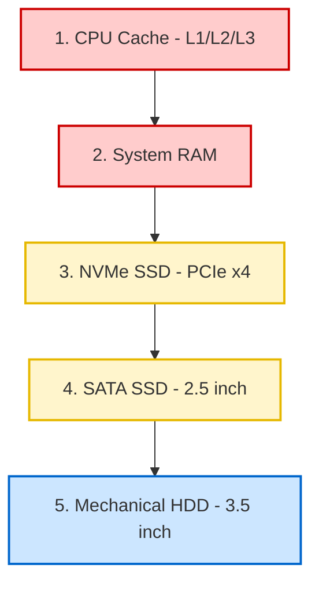

# 01-04 Storage Devices

> [!abstract] Overview
> Deep dive into storage drive architectures, differences between HDD, SATA SSD, and NVMe SSD, partitioning schemes, S.M.A.R.T analytics, and data recovery basics.

---

## What Is It? (Concept Explanation)
Storage drives are non-volatile hardware media used to store system files and data logs.



Storage devices store the operating system, applications, and user data permanently.
*Seedha simple shabdon mein: Storage drive computer ka permanent locker hai. HDD mechanical disk hoti hai jo slow ghoomti hai aur time ke sath kharab hoti hai. SATA SSD aur NVMe SSD electronic chips hain jo bohot fast kaam karti hain. SSD lagane se computer ki boot speed aur performance lagbhag 10x badh jati hai.*

---

## How It Works (Deep Dive)
- **HDD (Hard Disk Drive):** Uses magnetic platters and a moving read/write head. Speed is measured in RPM (typically 5400 or 7200 RPM). Highly prone to physical damage if dropped.
- **SATA SSD:** Uses NAND flash memory chips. Connects via standard SATA cables. Transfer speeds max out at around 550 MB/s.
- **NVMe M.2 SSD:** Uses PCIe lanes (Non-Volatile Memory Express) directly. Plugs directly into the motherboard. Modern Gen 4 NVMe speeds can exceed 7,000 MB/s.
- **S.M.A.R.T (Self-Monitoring, Analysis, and Reporting Technology):** A monitoring system integrated into drives that tracks parameters like bad sectors, temperature, power cycles, and read/write errors.
- **GPT vs. MBR:**
    - **MBR (Master Boot Record):** Legacy standard. Supports up to 2TB drive capacity and a maximum of 4 primary partitions.
    - **GPT (GUID Partition Table):** Modern standard. Required for UEFI boot systems. Supports drives larger than 2TB and unlimited partitions.

---

## Real-World Scenarios
**Scenario 1:** A user's desktop takes 10 minutes to reach the login screen, and Task Manager shows "Disk Usage" at 100% even when no applications are running.
- Problem: Persistent 100% disk usage and extreme lag.
- Root Cause: A mechanical HDD is failing, or excessive disk fragmentation is forcing the read/write head to work constantly.
- Solution: Run S.M.A.R.T diagnostic tools (like CrystalDiskInfo) to check drive health. If health is "Caution" or "Bad," back up data immediately and upgrade to an SSD.

**Scenario 2:** A user accidentally formatted a secondary D: drive containing important local archive folders.
- Problem: Data loss due to formatting.
- Root Cause: User mistake.
- Solution: Instruct the user to **stop using the PC immediately** to prevent overwriting sectors. Run data recovery software (like Recuva or EaseUS) to extract files before the system writes new data.

---

## Step-by-Step Troubleshooting Guide
1. **Check S.M.A.R.T Health:** Download and open CrystalDiskInfo or run CMD command to check drive status.
2. **Scan for Sector Errors:** Open CMD as administrator and run `chkdsk /f /r` to fix file system errors and locate bad sectors.
3. **Check Physical Connections:** If the drive is not detected in the BIOS, open the cabinet, unplug SATA power/data cables, clean dust, and connect them to a different SATA port.
4. **Isolate M.2 SSD issues:** If an M.2 SSD is not detected, reseat the drive in the slot and secure the locking screw.

---

## Essential CMD Commands for Storage Diagnostics
```cmd
:: Check S.M.A.R.T health status of all drives
wmic diskdrive get status

:: Scan and fix file system errors on C: drive (requires reboot)
chkdsk C: /f /r

:: Open Disk Management console (GUI utility for partitioning)
diskmgmt.msc
```

---

## Common Mistakes Desktop Support Engineers Make
> [!warning] Avoid These Mistakes
> - **Ignoring S.M.A.R.T warnings:** Never ignore "Caution" flags in diagnostics. A drive showing bad sectors can fail completely within days.
> - **Moving a computer while it is on:** Moving a PC with a running HDD can cause the read/write head to scrape the magnetic platter, destroying data.
> - **Performing deep writes during recovery:** Installing data recovery software directly onto the drive you are trying to recover from can overwrite the deleted files.

---

## SOP (Standard Operating Procedure)
- [ ] Power down the computer, disconnect power cables, and open the chassis.
- [ ] For M.2 SSD: Insert the card at a 30-degree angle, press down, and secure it with the M.2 screw.
- [ ] For SATA: Slide the drive into the mount bay, secure with screws, and plug in SATA data and power cables.
- [ ] Power on, enter BIOS, and verify the drive is detected.
- [ ] Boot Windows, open `diskmgmt.msc` (Disk Management), initialize the drive as GPT, partition it, format as NTFS, and assign a drive letter (e.g., D:).

---

## Pro Tips (From Senior Engineers)
> [!tip] Field Secrets
> - **SSD TRIM support:** Ensure TRIM is enabled in Windows for SSDs. It optimizes NAND cells and prevents performance degradation over time.
> - **BitLocker Lockout:** Always check if BitLocker is active on a drive before running deep sector repairs (`chkdsk`), as it can trigger a recovery key prompt.

---

## Quick Revision Summary
| # | Concept | Remember This |
|---|---------|---------------|
| 1 | HDD | Mechanical, slow (max ~150MB/s), prone to physical failure |
| 2 | NVMe SSD | Ultra-fast (up to 7000MB/s), plugs into PCIe slots |
| 3 | S.M.A.R.T | Built-in health tracking; look for bad sectors |
| 4 | GPT | Modern partition scheme, supports >2TB and UEFI boot |
| 5 | `chkdsk` | `/f` fixes errors; `/r` attempts recovery from bad sectors |

---

## Interview Questions & Model Answers
**Q1: What is the difference between HDD and SSD?**
A: HDDs are mechanical drives with spinning platters and moving heads, yielding slower speeds (up to 150MB/s) and vulnerability to physical shocks. SSDs use solid-state flash memory chips with no moving parts, offering much faster speeds (up to 550MB/s for SATA, 7000MB/s for NVMe) and greater physical durability.

**Q2: A user's external USB hard drive is not showing up in File Explorer. How do you troubleshoot?**
A: First, I would check if the drive light is on and if I hear it spinning. Second, I would open **Disk Management** (`diskmgmt.msc`) to see if the drive is listed. If it appears as "Unallocated," I would assign it a drive letter. If it doesn't show up at all, I would try a different USB port, a different cable, or test the drive on another PC.

**Q3: What does the command "chkdsk C: /f /r" do?**
A: The `/f` flag tells the utility to fix errors on the disk file system. The `/r` flag searches for bad sectors on the physical disk and attempts to recover readable information from them. Running this on a system drive requires a reboot to execute.

---

## Related Notes
- [[01-01 Computer Architecture Overview]] — Storage role in architecture
- [[02-10 System Recovery Tools]] — Running recovery scripts from WinRE
- [[08-03 Slow PC Diagnosis & Optimization]] — Diagnosing 100% disk usage bottlenecks

---

## Study Resources
- [Microsoft Learn: Troubleshooting Disk Management](https://learn.microsoft.com)
- CrystalDiskInfo Official Download Portal.