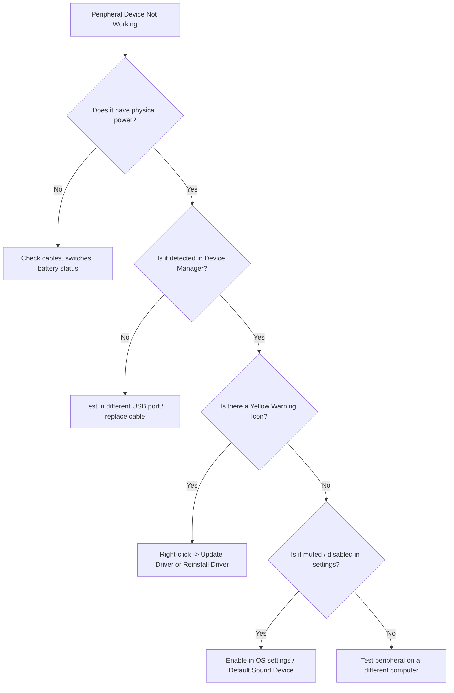

# 01-08 Peripheral Devices

> [!abstract] Overview
> An enterprise-grade guide to supporting client peripheral devices, including input devices, displays, audio interfaces, dock stations, and external storage systems. This note details interface standards, driver debugging, and troubleshooting guides for corporate workspaces.

---

## Concept Explanation: The Workspace Interfaces
Peripherals are external devices that expand a system's capabilities. They connect using various interface standards: USB, Thunderbolt, HDMI, Bluetooth, and Wi-Fi.
*Seedha simple shabdon mein bole toh: Keyboard, Mouse, Webcam, Headphones, Docking Station, aur External Drive - yeh sab peripheral devices hain. Desktop support engineering mein inke connections aur drivers ko debug karna aam baat hai kyunki users ke workspace mein inhi devices se problems aati hain.*

---

## Core Peripheral Interface Standards
Understanding interface types helps you configure setups correctly:

| Connection Standard | Max Data Speed | Max Power Delivery | Typical Use Case |
|---|---|---|---|
| **USB 2.0 (Type-A)** | 480 Mbps | 2.5W (5V, 500mA) | Keyboards, mice, older webcams |
| **USB 3.2 Gen 1 (Type-A/C)** | 5 Gbps | 4.5W (5V, 900mA) | External SSDs, corporate webcams |
| **USB 3.2 Gen 2x2 (Type-C)** | 20 Gbps | Up to 100W (USB-PD) | High-speed RAID arrays, modern laptops |
| **Thunderbolt 3 / 4** | 40 Gbps | Up to 100W (USB-PD) | Dual 4K monitors, docking stations, external GPUs |
| **Bluetooth 5.0 / 5.2** | 2 Mbps | Low Power | Wireless keyboards, mice, headsets |

---

## Support Scenarios & Driver Debugging

### Scenario 1: Laptop Docking Station Display Failures
- **Incident Description:** A user connects their Windows laptop to a USB-C Docking Station. The laptop charges, and the keyboard/mouse work, but the two external Dell monitors connected to the dock show "No Signal".
- **Troubleshooting Steps:**
  1. **Identify Connector Support:** Confirm if the laptop's USB-C port supports **DisplayPort Alt Mode** or **Thunderbolt**. (Standard data-only USB-C ports cannot output video signals).
  2. **Check Display Link Drivers:** Many enterprise docks (e.g., Dell WD19, Lenovo ThinkPad Docks) require specific drivers or firmware to support multiple displays.
  3. **Reset the USB Dock:** Unplug the dock's power adapter, disconnect the laptop, wait 30 seconds to drain capacitors, reconnect the power adapter, and plug the laptop back in.
  4. **Device Manager Verification:** Open Device Manager (`devmgmt.msc`), expand **Universal Serial Bus controllers**, and inspect for warning flags (yellow triangles). Update or reinstall the dock's USB hub drivers.
- **Resolution:** Reinstalled the DisplayLink graphics driver, updated the dock's firmware using the official utility, and connected the laptop to the correct Thunderbolt port (marked with a lightning flag symbol).

---

## Step-by-Step Diagnostic Guide: Peripheral Failures
If an external device is not working, follow this logical flow:



1. **Verify Physical Layer:** Check if the device is turned on, has charged batteries (for wireless devices), and is securely plugged into a functioning USB port.
2. **Device Manager Audit:** Open `devmgmt.msc`. Look for the device under its category (e.g., Webcams under "Cameras", Keyboards under "Keyboards").
3. **Handle Driver Code 43 (Device Descriptor Request Failed):** This error indicates hardware communication issues. Right-click the item, select **Uninstall Device**, restart the PC, and let Windows reinstall the default driver.
4. **Select Audio Outputs:** If a USB headset has no audio, search for **Sound Settings** in Windows, and ensure the headset is set as both the **Default Output Device** and **Default Communication Device**.

---

## Helpful Commands & Shortcuts
Quick keyboard combinations and commands to resolve peripheral issues:

```cmd
:: Open Device Manager utility directly (CMD)
devmgmt.msc

:: Open Sound configuration panel (CMD/Run)
control mmsys.cpl sounds

:: Scan for hardware changes via command line (PowerShell)
pnputil /scan-devices
```

---

## Common Mistakes to Avoid
> [!warning] Configuration Errors
> - **Using Display Cables Incorrectly:** Daisy-chaining monitors using DisplayPort (MST) when the graphics card or laptop's built-in GPU doesn't support Multi-Stream Transport. This duplicates the image across screens instead of extending the desktop.
> - **Overloading USB Bus Bandwidth:** Connecting high-bandwidth peripherals (like 4K webcams, external SSDs, and network adapters) to a single external, unpowered USB hub. This causes device disconnects and data loss.

---

## Related Notes
- [[01-10 Hardware Troubleshooting Masterclass]] - Full system diagnostics
- [[13-06 Printer Setup SOP (Local & Network)]] - Printer provisioning manual
- [[12-01 Windows Keyboard Shortcuts (Complete)]] - Core keyboard hotkeys