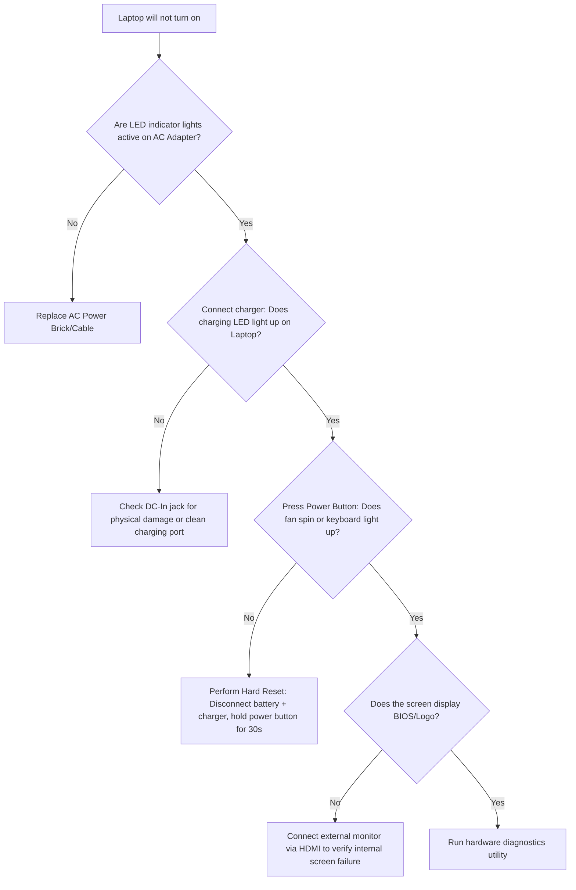

# 01-09 Laptop-Specific Support

> [!abstract] Overview
> A comprehensive guide to supporting corporate laptop fleets. This note covers key differences between desktops and laptops, replacing field-replaceable units (FRUs), managing battery health, and diagnosing power, charging, and display failures.

---

## Concept Explanation: The Mobile Workstation
Laptops pack standard desktop capabilities into a compact, mobile package. This integration makes laptop components harder to repair and replace.
*Seedha simple shabdon mein bole toh: Laptop support mein physical restrictions hoti hain. Desktops ki tarah parts badalna aasan nahi hota. Battery swelling, screen damage, charging port issue, aur Wi-Fi antenna problems yahan common hote hain. Inhe carefully handle karna padta hai.*

---

## Key Laptop Components & Support Challenges
Laptops contain specialized, low-power components designed for mobility:

- **SO-DIMM RAM:** Small Outline Dual In-line Memory Modules, about half the size of desktop UDIMMs. Modern ultra-thin laptops may have RAM soldered directly to the motherboard, meaning you cannot upgrade it.
- **Lithium-Ion / Li-Polymer Batteries:** Provide portable power. Over time, chemical degradation decreases their capacity. They can also swell, presenting a safety hazard.
- **M.2 Form Factor SSDs:** Use compact NVMe PCIe slots. Modern systems use M.2 2280 or the smaller 2230 size.
- **Display Assembly:** Includes the LCD panel, webcam, microphone array, and Wi-Fi/Bluetooth antenna wires routed through the hinges into the lid.

---

## Support Scenarios & Battery Management

### Scenario 1: Swollen Laptop Battery Diagnosis & Disposal
- **Incident Description:** A user brings in a Dell Latitude laptop, complaining that the touchpad is hard to click and the lower keyboard area looks warped and raised.
- **Safety Protocol:**
  > [!caution] Fire and Chemical Hazard
  > A swollen battery is a fire hazard. Never puncture, bend, or force a swollen battery out of a system. Do not connect the laptop to AC power once swelling is observed.
- **Troubleshooting & Removal Steps:**
  1. Disconnect the AC charger immediately.
  2. Put on safety glasses and ESD protection.
  3. Work on a clean, non-flammable surface.
  4. Carefully unscrew the laptop back cover. (Loosen captive screws slowly, as pressure from the swollen battery might push the cover up).
  5. Locate the battery connector and pull it straight out from the motherboard socket.
  6. Unscrew the battery bracket screws, lift the battery out, and place it in a certified fire-resistant container (e.g., filled with sand or dry fire-suppression granules).
- **Resolution:** Replaced the battery with a new OEM battery, verified the touchpad worked correctly, and sent the old battery to a certified recycling facility.

---

## Step-by-Step Diagnostic Checklist: Laptop Power Issues
If a laptop refuses to power on or charge, use this diagnostic checklist:



1. **Perform a Hard Reset (Static Drain):** 
   - Disconnect the AC power adapter.
   - Remove the bottom cover and disconnect the internal battery.
   - Disconnect any peripheral devices and external monitors.
   - Press and hold the power button down for **30 to 45 seconds** to drain residual electrical charge from motherboard capacitors.
   - Reconnect only the AC power adapter (leave the battery disconnected), and press the power button. If it boots, power down, reconnect the battery, and test again.
2. **Diagnostic Utilities:** Most enterprise laptops have built-in diagnostics. For Dell, press **F12** on startup and select **Diagnostics** (ePSA). For HP, press **F2** or **Esc**.
3. **Verify Battery Health (CLI):** Run Windows battery reports to verify capacity degradation.

---

## Battery Diagnostics Commands
Generate an official HTML battery report in Windows to check capacity metrics:

```cmd
:: Generate a detailed battery health report in CMD (saved to system32 or current directory)
powercfg /batteryreport

:: Query active system sleep states and power capabilities
powercfg /a

:: Check battery status using PowerShell WMI querying
Get-CimInstance -Namespace root/wmi -ClassName Msri_SystemBatteryState
```

*Open the generated `battery-report.html` file in a browser. Compare **Design Capacity** (original size) with **Full Charge Capacity** (current maximum charge). If the full charge capacity is under 60% of the design capacity, recommend replacing the battery.*

---

## Common Mistakes to Avoid
> [!warning] Laptop Care Pitfalls
> - **Prying the Laptop Case:** Using metal flathead screwdrivers or sharp tools to pry open plastic laptop casing clips. This can scratch the chassis or short components on the motherboard. Always use non-conductive plastic spudgers.
> - **Replacing Screens with Power Connected:** Replacing an LCD display assembly while the internal battery is connected. The display backlighting circuit carries live current, which can easily blow the backlight fuse on the motherboard if shorted during installation.

---

## Related Notes
- [[01-10 Hardware Troubleshooting Masterclass]] - System diagnostics
- [[01-03 RAM & Memory]] - Memory formats (SO-DIMM vs. UDIMM)
- [[13-02 New PC Setup & Imaging SOP]] - Workstation staging guidelines