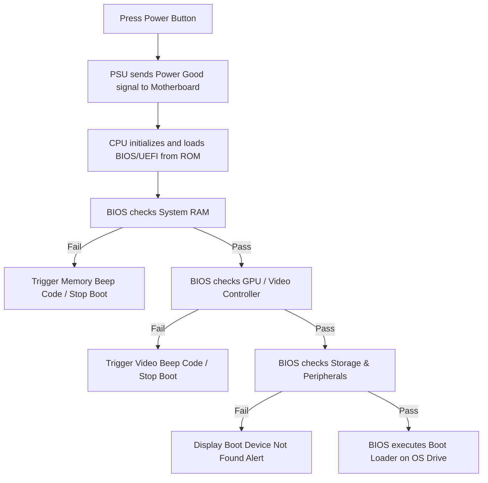

# 01-10 Hardware Troubleshooting Masterclass

> [!abstract] Overview
> An advanced diagnostic manual for troubleshooting hardware failures. This note details POST errors, BIOS beep codes, diagnostic LEDs, system thermal issues, storage errors, and the logical isolation methods used to fix issues.

---

## Concept Explanation: Logical Hardware Isolation
Hardware troubleshooting requires systematic, logical isolation of variables. Guessing root causes leads to wasted time and unnecessary parts replacements.
*Seedha simple shabdon mein bole toh: Jab koi PC boot nahi hota ya achanak crash hota hai, toh saare parts ko ek sath badalne ki jagah hum components ko ek-ek karke isolate karte hain. Sabse pehle Power supply check hoti hai, fir POST beep codes dekhe jaate hain, fir RAM aur SSD check hoti hai. Yeh structured process time aur money dono bachata hai.*

---

## The Power-On Self-Test (POST) Flow
Every time a computer powers on, the BIOS/UEFI firmware runs a diagnostic check called the **Power-On Self-Test (POST)**. It validates that key components (CPU, RAM, GPU, Storage) are present and working.



---

## BIOS Beep Codes & Diagnostic Indicators
If a system fails to POST, it cannot display an error on the screen. Instead, the motherboard communicates using audio beep codes or LED diagnostic patterns:

### Standard AMI BIOS Beep Codes
- **1 Short Beep:** System is OK. Normal POST execution.
- **2 Short Beeps:** Memory parity error. RAM failed validation in the first 64KB block.
- **3 Short Beeps:** Base 64KB memory failure. Reseat or replace the RAM module.
- **5 Short Beeps:** Processor (CPU) failure. Check CPU installation or replace CPU.
- **8 Short Beeps:** Display adapter read/write error. Reseat the GPU or check video card memory.

### Modern Enterprise Diagnostic LEDs
Dell and Lenovo systems use flashing LED patterns on the Power Button or diagnostic LEDs (e.g., orange and white flashes).
*Example:* Dell Latitude battery LED flashes **3 Amber, 2 White** = PCI / Video failure. **2 Amber, 3 White** = System board, BIOS ROM, or chipset error.

---

## Troubleshooting Core Hardware Issues

### 1. System Overheating & Thermal Throttling
- **Symptoms:** Workstation runs loud, performance drops under load, or the PC shuts down suddenly without warning.
- **Diagnostic Steps:**
  1. Install hardware monitoring utilities (e.g., HWMonitor) and check CPU temperatures. Thermal throttling begins around **85°C to 90°C**; emergency thermal shutdown occurs around **100°C to 105°C**.
  2. Open the chassis and check if cooling fans are spinning and the heatsink is clear of dust.
  3. Verify the CPU heatsink is securely mounted.
- **Resolution:** Clean dust from fans and heatsinks using compressed air, remove dried thermal paste, apply new high-quality thermal compound, and remount the heatsink.

### 2. RAM Failure & Intermittent BSODs
- **Symptoms:** System crash screens (BSODs) showing memory-related errors like `MEMORY_MANAGEMENT` or `PAGE_FAULT_IN_NONPAGED_AREA`.
- **Diagnostic Steps:**
  1. Boot into Windows Administrative Tools and run **Windows Memory Diagnostic** (or boot from an external USB running **MemTest86**).
  2. Run at least two full passes of MemTest86. If any errors are found, shut down the PC.
  3. Remove all RAM modules except one. Test each module individually in Slot 1.
- **Resolution:** Isolate the failing RAM module and replace it. Ensure remaining modules are configured in dual-channel mode.

---

## Essential Commands & Diagnostics
Run these commands in Windows to check hardware health:

```cmd
:: Launch Windows Memory Diagnostic tool next restart
mdsched.exe

:: Check SMART hard drive status for quick validation (CMD)
wmic diskdrive get status, model

:: Run System File Checker to repair OS corruption caused by hardware failure
sfc /scannow
```

---

## Common Mistakes to Avoid
> [!warning] Troubleshooting Mistakes
> - **Replacing Motherboards Prematurely:** Attributing POST failures to a dead motherboard without testing the power supply or checking for short circuits from misplaced chassis standoffs.
> - **Hot-Plugging Internal Components:** Plugging in internal RAM, GPUs, or SATA cables while the system is powered on or plugged into the wall. This can ruin the component and the motherboard slot.

---

## Advanced Hardware POST Codes Diagnostics
When a motherboard fails to POST, technicians utilize PCIe Diagnostic POST cards to read error codes from the BIOS bus:
- **Code 00 / FF:** Indicates the CPU is not executing instructions. Check socket pins or CPU voltage rails.
- **Code D0 / D3:** Indicates a memory initialization error. Reseat RAM or test compatibility.
- **Code 2A / 2B:** Indicates a VGA initialization failure. Reseat the GPU or check the PCIe slot connection.

## Related Notes
- [[08-02 BSOD (Blue Screen of Death) Analysis]] - Windows software debugger guide
- [[01-07 BIOS & UEFI Configuration]] - Standard configuration parameters
- [[12-05 BSOD Stop Codes Reference]] - Quick diagnostics key