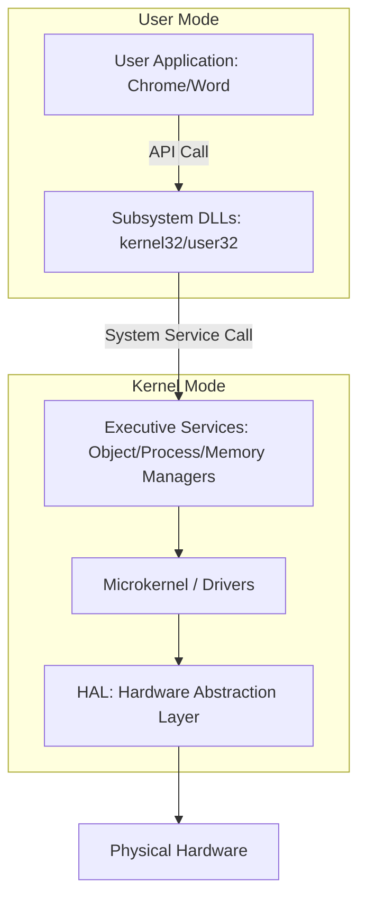

# 02-01 Windows Architecture Overview

> [!abstract] Overview
> Deep dive into the internal structure of the Windows NT operating system, including User Mode, Kernel Mode, the Hardware Abstraction Layer (HAL), and the boot sequence. Understanding this architecture allows engineers to trace root causes of OS-level crashes.

---

## What Is It? (Concept Explanation)
Windows OS is split into two major execution environments: **User Mode** and **Kernel Mode**.
*Seedha simple shabdon mein: User Mode ek safety area hai jahan normal programs (Word, Chrome) chalte hain taaki agar wo crash bhi ho jayein toh pura system shut down na ho. Aur Kernel Mode computer ka engine room hai, jahan direct hardware interaction hota hai. HAL (Hardware Abstraction Layer) hardware ke complicated differences ko chipakar OS ko standard functions deta hai.*

---

## How It Works (Deep Dive)
Windows NT architecture is modular. When an application runs, it doesn't talk directly to the hardware. Instead, it interacts through API subsystems.



### 1. User Mode Subsystems
- **Win32 Subsystem:** The native environment for 32-bit and 64-bit applications. Subsystem DLLs (like `kernel32.dll`, `user32.dll`, `gdi32.dll`) translate application actions into system calls.
- **System Processes:** Logically isolated helper processes like `smss.exe` (Session Manager), `winlogon.exe` (Windows Logon), and `lsass.exe` (Local Security Authority).

### 2. Kernel Mode Components
- **Windows Executive:** Contains subsystems for memory management (`Mm`), process management (`Ps`), and security monitoring.
- **Microkernel:** Coordinates thread scheduling, interrupt handling, and multiprocessor synchronization.
- **Device Drivers:** Translate system commands into hardware signals. Drivers run inside kernel space, meaning a bug in a driver can trigger a system-wide halt.
- **Hardware Abstraction Layer (HAL):** A low-level dynamic link library (`hal.dll`) that acts as a translation bridge. It prevents kernel developers from writing unique code for different motherboards.

### 3. Windows Boot Process (UEFI System)
1. **Power-On Self-Test (POST):** Motherboard checks hardware configurations.
2. **UEFI Boot Manager:** Reads NVRAM boot entries and loads `bootmgfw.efi` from the EFI System Partition (ESP).
3. **Windows Boot Manager (`bootmgr`):** Reads the Boot Configuration Data (BCD) store and determines boot options.
4. **Windows OS Loader (`winload.efi`):** Loads the kernel (`ntoskrnl.exe`), the HAL, boot-start drivers, and system registry hive.
5. **Session Manager (`smss.exe`):** Creates user sessions, starts security systems, and executes `winlogon.exe`.

---

## Real-World Scenarios
**Scenario 1:** A user reports that whenever they plug in a generic USB webcam, the system immediately crashes with a Blue Screen of Death (BSOD).
- Problem: Plugging in the webcam triggers a driver crash.
- Root Cause: The webcam driver runs in Kernel Mode. A memory access violation inside the driver causes a kernel panic (`SYSTEM_THREAD_EXCEPTION_NOT_HANDLED`).
- Solution: Restart in Safe Mode, uninstall the generic webcam driver in Device Manager, and install the certified manufacturer driver.

**Scenario 2:** Chrome crashes frequently, showing an "Out of Memory" alert, but the desktop and other applications continue to run.
- Problem: Chrome stops responding or shuts down.
- Root Cause: Chrome runs in User Mode and is allocated a specific virtual address space. When it hits memory limits, Windows terminates the application process (`chrome.exe`) to protect other applications.
- Solution: Increase virtual memory paging file size, close redundant tabs, or upgrade RAM.

---

## Step-by-Step Troubleshooting Guide
1. **Identify the Mode of Crash:** If only a single app closes, it is a User Mode issue. If the OS displays a blue screen and reboots, it is a Kernel Mode issue.
2. **Isolate Driver Conflicts:** Run `verifier.exe` (Driver Verifier) to stress-test drivers and isolate which kernel component is causing crashes.
3. **Verify HAL Health:** If hardware changes occurred (e.g., swapping a CPU/Motherboard), verify the correct `hal.dll` version is running.
4. **Escalate when:** Memory diagnostic passes, drivers are clean, but system kernel repeatedly fails (indicates physical CPU or Motherboard chipset breakdown).

---

## Important Commands / Shortcuts
```cmd
:: Launch Driver Verifier Manager (run in elevated CMD)
verifier
:: Display detailed system configuration details and boot pathways
systeminfo
:: Check boot configurations details in UEFI
bcdedit /enum
```

---

## Common Mistakes to Avoid
> [!warning] Watch Out
> - **Never install unsigned drivers:** Unsigned drivers bypass Microsoft's stability testing. Since they execute in Kernel Mode, a minor bug can cause persistent BSODs.
> - **Confusing App Crash with System Crash:** Reinstalling the entire OS because a single browser keeps crashing is an overkill. User Mode app crashes require app-level fixes (cache clear, reinstalling app).

---

## SOP (Standard Operating Procedure)
- [ ] Determine if the failure is application-specific (User Mode) or system-wide (Kernel Mode).
- [ ] Extract the stop code and driver file name from the dump file.
- [ ] Run `sfc /scannow` to verify core system DLL integrity.
- [ ] Update or roll back the driver listed in the crash report.
- [ ] Verify the issue is resolved and log the driver details in the ticket.

---

## Pro Tips (Senior Engineer Secrets)
> [!tip] From the Field
> When debugging kernel crashes, check the timestamp of the crashing `.sys` file. If it dates back several years, it's outdated and incompatible with modern Windows updates.

---

## Quick Revision Summary
| Component | Mode | Function |
|---|---|---|
| Chrome/Outlook | User Mode | Applications with restricted access. |
| `ntoskrnl.exe` | Kernel Mode | Windows Operating System Core engine. |
| `hal.dll` | Kernel Mode | Translates OS actions to physical motherboard signals. |
| `winload.efi` | Boot Phase | Loads Kernel and boot-start drivers from disk. |

---

## Interview Q&A Bank
**Q1: What is the difference between User Mode and Kernel Mode?**
A: User Mode is a restricted execution environment where standard applications run, preventing them from accessing hardware directly. Kernel Mode has unrestricted access to system memory and hardware. A crash in User Mode only closes the app, while a crash in Kernel Mode crashes the entire OS.

**Q2: What is the HAL in Windows?**
A: The Hardware Abstraction Layer (HAL) is a low-level dynamic library (`hal.dll`) that sits between the physical hardware and the kernel. It hides motherboard-specific architecture differences from the OS kernel, allowing a single Windows build to run on different processors.

---

## Related Notes
- [[02-04 Windows Services & Processes]]
- [[08-02 BSOD (Blue Screen of Death) Analysis]]

---

## Study Resources
- [Windows Kernel-Mode Architecture - MS Docs](https://docs.microsoft.com/en-us/windows-hardware/drivers/kernel/)
- Windows Internals Book by Mark Russinovich.