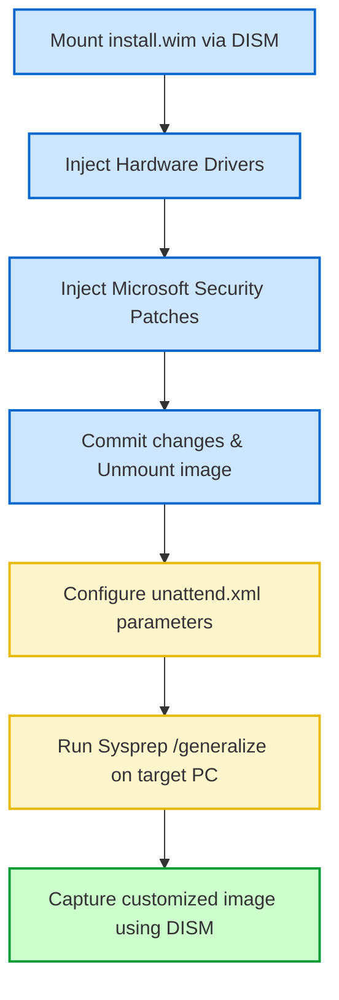

# 02-02 Windows Installation & Deployment

> [!abstract] Overview
> Step-by-step methods for Windows installations, difference between KMS, MAK, and digital licenses, and deploying OS images across a local network using PXE.

---

## What Is It? (Concept Explanation)
Operating System deployment involves installing customized images onto corporate client workstations.



OS deployment is the process of installing a fresh Windows operating system onto a machine.
*Seedha simple shabdon mein: Ek single PC pe USB lagake Windows install karna easy hai (Clean Install). Par jab 500 PCs par ek sath install karna ho, tab hum network install (PXE Boot) ya images (Sysprep + WIM) use karte hain taaki time bache.*

---

## How It Works (Deep Dive)

### 1. Installation Types
- **Clean Installation:** Erases all previous data on the drive. Best for fixing major corruption or setting up brand-new SSDs.
- **In-Place Upgrade:** Retains files, settings, and installed applications. Used when migrating from Windows 10 to 11.
- **Custom Image Deployment:** Creating a master Windows installation, running `Sysprep` to generalize SID (Security Identifier) info, capturing it as a `.wim` file, and applying it to client machines.

### 2. Enterprise Activation Methods
- **KMS (Key Management Service):** Uses a local server within the corporate network. Client computers activate by connecting to this KMS host over the LAN. Must contact host every 180 days.
- **MAK (Multiple Activation Key):** A single activation key that can activate a set number of devices by connecting directly to Microsoft licensing servers over the internet.
- **OEM (Original Equipment Manufacturer) Key:** Embedded in the motherboard firmware at the factory. Activates automatically when connected to the internet.

---

## Real-World Scenarios
**Scenario 1:** A user's PC displays a watermark: "Activate Windows - Go to Settings to activate Windows." The user is working remotely.
- Problem: KMS client fails to activate.
- Root Cause: The client has been away from the corporate network for over 180 days and cannot reach the local KMS server.
- Solution: Connect the user to the corporate VPN so the KMS client can communicate with the KMS host port 1688, or run activation scripts manually.

---

## Step-by-Step Troubleshooting Guide
1. **Check Activation Status:** Open CMD and type `slmgr.vbs /dlv` to check active licensing model (KMS/MAK).
2. **Verify Network Connectivity:** If it is a KMS client, verify it can resolve the KMS server name and ping its IP address.
3. **Reset Licensing state:** If activation fails with generic code `0xC004C003`, reset state:
   ```cmd
   slmgr.vbs /upk
   slmgr.vbs /ckms
   slmgr.vbs /ipk <New-Product-Key>
   slmgr.vbs /ato
   ```

---

## Important Commands / Shortcuts
```cmd
:: Force online activation
slmgr.vbs /ato
:: View activation details and expiration data
slmgr.vbs /xpr
:: Check license type (OEM, Retail, Volume)
slmgr.vbs /dli
```

---

## Common Mistakes to Avoid
> [!warning] Watch Out
> - **Skipping Sysprep:** Never copy a hard drive image directly to another PC without running `sysprep /generalize`. Doing so duplicates the Security Identifier (SID), causing AD domain join conflicts.

---

## SOP (Standard Operating Procedure)
- [ ] Connect client machine to network cable (for PXE boot) or insert Windows install USB.
- [ ] Boot device and access BIOS. Set boot order to network/USB.
- [ ] Follow Windows setup prompts to format the system partition as NTFS.
- [ ] Once installed, run updates and verify activation status.
- [ ] Run `slmgr.vbs /ato` to verify successful licensing activation.

---

## Quick Revision Summary
| Activation Type | Server Target | Renewal Interval |
|---|---|---|
| KMS | Corporate LAN Server | Required every 180 days |
| MAK | Microsoft Online | One-time per device |
| OEM | Motherboard BIOS | Permanent activation |

---

## Interview Q&A Bank
**Q1: What is the DORA process? (Wait, that is DHCP, let's ask about KMS vs MAK)**
A: KMS uses a local corporate server to activate Windows clients over LAN, requiring renewal every 180 days. MAK is a volume key that activates machines directly against Microsoft servers once.

---

## Advanced WIM Imaging & Driver Injection
When staging customized operating system deployment files, desktop support engineers utilize the Deployment Image Servicing and Management (DISM) command-line utility to inject critical drivers and updates directly into the offline Windows image (.wim) file. This ensures compatibility during installation.

### Step-by-Step Offline Servicing Workflow
1. **Mount the Image:** Create a local mount directory and mount the installer file (`install.wim`):
   `dism /mount-wim /wimfile:C:\images\install.wim /index:1 /mountdir:C:\mount`
2. **Inject Drivers:** Add storage (SATA/NVMe) and network (NIC) driver packages:
   `dism /image:C:\mount /add-driver /driver:C:\drivers /recurse /forceunsigned`
3. **Inject Security Patches:** Apply Windows Update cabinet (.cab) files to secure the image:
   `dism /image:C:\mount /add-package /packagepath:C:\patches\KB501291.cab`
4. **Commit and Unmount:** Save changes and unmount the filesystem:
   `dism /unmount-wim /mountdir:C:\mount /commit`

### Sysprep and Unattend.xml Customization
Before capturing a golden deployment image, technicians run **Sysprep** (System Preparation Tool) to generalize the OS, removing unique hardware identifiers, security identifiers (SIDs), and driver states:
`C:\Windows\System32\sysprep\sysprep.exe /generalize /oobe /shutdown /unattend:C:\temp\unattend.xml`
The `unattend.xml` file automates post-installation configuration, defining default language settings, local administrator passwords, computer naming conventions, and domain join parameters.

## Related Notes
- [[02-03 Windows Registry]]
- [[04-04 Computer Account Management]]