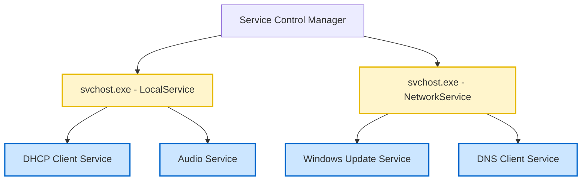

# 02-04 Windows Services & Processes

> [!abstract] Overview
> A guide to managing Windows services and processes. This note details service start types, how host processes (svchost.exe) function, and diagnostic commands to manage resources and troubleshoot application hangs.

---

## 1. What Is It? (Concept Explanation)
Background services and running user processes are managed by the Windows Service Control Manager.



A **Process** is an active instance of a running application (e.g., `chrome.exe` or `outlook.exe`), visible in Task Manager. A **Service** is a specialized background process that runs without direct user interaction (e.g., `Spooler` for printing or `Dhcp` for network configuration).
*Seedha simple shabdon mein bole toh: Process woh programs hain jinhe user kholta hai aur interact karta hai. Service background mein dabi rehti hai, jaise security systems ya networking rules. Agar printer kaam nahi kar raha, toh 90% chances hain ki background Print Spooler service crash ho gayi hai.*

---

## 2. Technical Deep-Dive: svchost.exe & Service Control Manager
The Windows OS manages background processes using the **Service Control Manager (SCM)**. SCM acts as the launcher and monitor of services.

### The Role of svchost.exe (Service Host)
Many Windows services are compiled as Dynamic Link Library (.dll) files rather than standalone Executable (.exe) files. Because Windows cannot launch a `.dll` directly as a process, it uses a generic host process called **`svchost.exe`** to load the `.dll`.
- **Grouping:** To save memory, multiple related services are grouped inside a single `svchost.exe` process (e.g., LocalService, NetworkService).
- **High CPU Troubleshooting:** If a single `svchost.exe` consumes 100% CPU, you can identify the exact sub-service using Task Manager (Go to Details, right-click columns, check "Command Line" or go to the "Services" tab) or Sysinternals **Process Explorer**.

---

## 3. Service Startup Types
Windows services use four main startup types, which can be configured via `services.msc` or Command Line:

| Startup Type | Behavior at Boot | Typical Example Services |
|---|---|---|
| **Automatic** | Starts during boot time when the operating system loads. | `CryptSvc` (Cryptographic Services), `LanmanWorkstation` (Workstation) |
| **Automatic (Delayed Start)** | Starts 2-3 minutes after boot to reduce resource contention during startup. | `wuauserv` (Windows Update), `MapsBroker` (Maps Manager) |
| **Manual** | Starts only when requested by the OS, a running application, or user. | `PrintSpooler` (when printing begins), `AppReadiness` |
| **Disabled** | Locked. Cannot be started by the system or users. | `RemoteRegistry` (often disabled for security hardening) |

---

## 4. Real-World Support Scenario (STAR Ticket)
- **Situation:** A user reports they cannot print any document. They see multiple prints stuck in the printer queue, and trying to cancel them does nothing. The print dialog box hangs when they try to click print from Microsoft Word.
- **Task:** Unhang the printing queue, clear corrupted print files, and restart the spooler service safely.
- **Action:**
  1. Tried to open the Services Console (`services.msc`), located **Print Spooler**, and clicked "Restart". The status became stuck in "Stopping" and did not recover.
  2. Opened Command Prompt as Administrator.
  3. Identified the Process ID (PID) of the Print Spooler service using `tasklist`:
     ```cmd
     tasklist /fi "services eq spooler"
     ```
  4. Forcefully terminated the spooler process using `taskkill` since the service was hung:
     ```cmd
     taskkill /f /im spoolsv.exe
     ```
  5. Cleared out the corrupted print files cached in the printers directory:
     ```cmd
     del /q /f /s "%systemroot%\System32\Spool\PRINTERS\*.*"
     ```
  6. Started the service back up:
     ```cmd
     net start spooler
     ```
- **Result:** The Print Spooler service started successfully, the hung print queue cleared, and the user successfully printed a test document.

---

## 5. Essential Process & Service Management Commands

### Query Service Status (CMD)
```cmd
:: Get status of a service (e.g., Windows Update)
sc query wuauserv
```

### Stop/Start Services (CMD)
```cmd
:: Stop a service
net stop spooler

:: Start a service
net start spooler
```

### Kill a Process by Process ID (CMD)
```cmd
:: Terminate a hung process using PID 4512
taskkill /f /pid 4512
```

### Check Process Memory & CPU Usage (PowerShell)
```powershell
# Get top 5 processes consuming the most memory
Get-Process | Sort-Object WorkingSet -Descending | Select-Object -First 5 Name, ID, WorkingSet
```

---

## 6. Frequently Asked Questions (FAQ)

**Q1: What is the difference between net start/stop and sc start/stop?**
A: `net` commands are synchronous; they will wait for the service to finish starting or stopping before returning a message. `sc` commands are asynchronous; they send the command to the Service Control Manager and return immediately, meaning the service might still be in a pending state.

**Q2: Why does svchost.exe show high memory usage on corporate machines?**
A: Because `svchost.exe` hosts multiple background services. If a service (like Windows Update or a third-party monitoring agent) has a memory leak, it will manifest as high memory consumption by `svchost.exe`.

**Q3: Can I run a service under a specific user account instead of System?**
A: Yes. In `services.msc`, right-click a service, select Properties, go to the "Log On" tab, and choose "This account". Enter the service account credentials (common for databases or automated task tools).

**Q4: How do I change a service's startup type using command line?**
A: You can use the `sc config` command. For example, to set the Print Spooler to manual, run: `sc config spooler start= demand` (note the space after `start=`).

---

## Related Notes
- [[06-06 Printer & Printing Support]] - Advanced printer troubleshooting
- [[09-02 PowerShell for Desktop Support]] - Service script controls
- [[12-01 Windows Keyboard Shortcuts (Complete)]] - Task Manager shortcuts