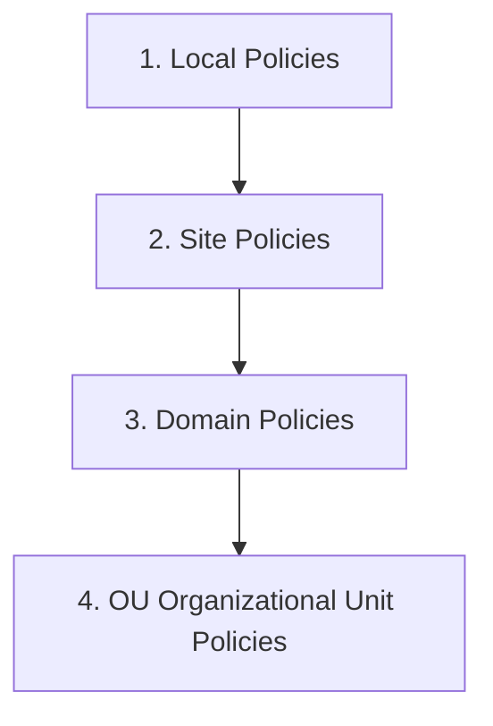

# 02-05 Group Policy (GPO)

> [!abstract] Overview
> A detailed overview of Group Policy Objects (GPOs) in an enterprise domain. This note covers the GPO application hierarchy, policy updating, troubleshooting registry-policy mismatches, and parsing group policy logs.

---

## 1. What Is It? (Concept Explanation)
Group Policy is a feature of Microsoft Windows Active Directory that allows administrators to manage computer and user configurations from a central domain controller.
*Seedha simple shabdon mein bole toh: Group Policy ek rulebook hai jo company ke saare computers par control banaye rakhti hai. Jaise usb drives block karna, automatic screen lock timing lagana, ya share folder link karna - ye sab settings IT admin ek baar server par define karta hai aur woh network ke saare PCs par automatically apply ho jaati hain.*

---

## 2. Technical Deep-Dive: GPO Application Hierarchy (LSDOU)
When a computer boots up and a user logs on, Windows evaluates and applies Group Policies in a specific order. The last applied policy wins and overwrites conflicting settings:



1. **Local Policies (L):** Stored directly on the client machine (via `gpedit.msc`).
2. **Site Policies (S):** Linked to the Active Directory physical network site.
3. **Domain Policies (D):** Linked to the main domain root (applies to all computers in the domain).
4. **Organizational Unit (OU) Policies (OU):** Linked to the specific OU where the computer/user account resides. (OUs nested deepest apply last).

### Policy Conflicts & Overriding Rules
- **Enforced (No Override):** A setting marked as Enforced at the Domain level cannot be overridden by an OU GPO.
- **Block Inheritance:** An OU can block policy settings from parent domains unless the parent GPO is marked "Enforced".
- **Loopback Processing Mode:** Typically, User configurations apply to the logged-in user regardless of the computer. When Loopback Processing is enabled (Replace or Merge), user configurations are overridden by the GPOs linked to the computer's OU (crucial for terminal servers or kiosks).

---

## 3. Real-World Support Scenario (STAR Ticket)
- **Situation:** A marketing executive says their background wallpaper has not updated to the new company branding, and their corporate network file shares (S: drive) are missing, although their colleagues' PCs updated yesterday.
- **Task:** Identify why GPOs are not applying to the user's PC, force GPO updates, and restore the settings.
- **Action:**
  1. Verified the computer had an active connection to the domain controller using ping: `ping domaincontroller.company.local`.
  2. Opened Command Prompt as Administrator and attempted to update GPO:
     ```cmd
     gpupdate /force
     ```
  3. The command completed, but the settings did not apply. Generated a GPO HTML diagnostic report:
     ```cmd
     gpresult /h C:\temp\gp_report.html /f
     ```
  4. Opened the report and reviewed the "Applied GPOs" list. Found that the user's computer account was residing in the default "Computers" OU rather than the "Marketing OU". Default computers do not receive network share mapping policies.
  5. Contacted the Active Directory administrator to move the computer account to the correct Marketing OU container.
  6. Once moved, ran `gpupdate /force` again and restarted the workstation.
- **Result:** The correct GPOs applied, the company wallpaper updated, and the S: drive mapped successfully.

---

## 4. Essential GPO Troubleshooting Commands

### Force Immediate Group Policy Update (CMD)
```cmd
:: Force a complete update of all user and computer policies
gpupdate /force
```

### Generate Quick Command Line GPO Report (CMD)
```cmd
:: Display applied GPOs and group memberships for active user
gpresult /r
```

### Generate Detailed GPO Diagnostic Report (CMD)
```cmd
:: Export complete GPO report to HTML format
gpresult /h C:\temp\gpreport.html /f
```

### Check GP Application Log in Event Viewer (PowerShell)
```powershell
# Get recent Group Policy event log logs
Get-WinEvent -LogName "Microsoft-Windows-GroupPolicy/Operational" -MaxEvents 5
```

---

## 5. Frequently Asked Questions (FAQ)

**Q1: What is the difference between Computer Configuration and User Configuration in GPOs?**
A: Computer Configuration settings are applied when the machine boots up and apply to all users who log on to that device. User Configuration settings are applied when a specific user logs on, regardless of which computer they are using.

**Q2: How often do client computers update Group Policies automatically?**
A: By default, client computers query Domain Controllers for GPO updates every 90 minutes (with a random 30-minute offset to prevent server overload). Group policy settings can also be forced immediately using `gpupdate /force`.

**Q3: What is the Local Group Policy Editor?**
A: It is a local console (`gpedit.msc`) available on Windows Professional, Enterprise, and Education editions, used to configure settings for a single offline PC. It is not available on Windows Home edition.

**Q4: What does the error "The computer policy could not be updated successfully" indicate?**
A: This usually indicates a network connectivity issue, DNS resolution failure when locating the domain controllers, or corrupted local policy registry files (`Registry.pol`).

---

## Related Notes
- [[04-05 Group Policy for Support Engineers]] - Domain-level policies administration
- [[04-01 Active Directory Fundamentals]] - Directory structures
- [[12-02 CMD & PowerShell Commands Cheat Sheet]] - Diagnostic commands list