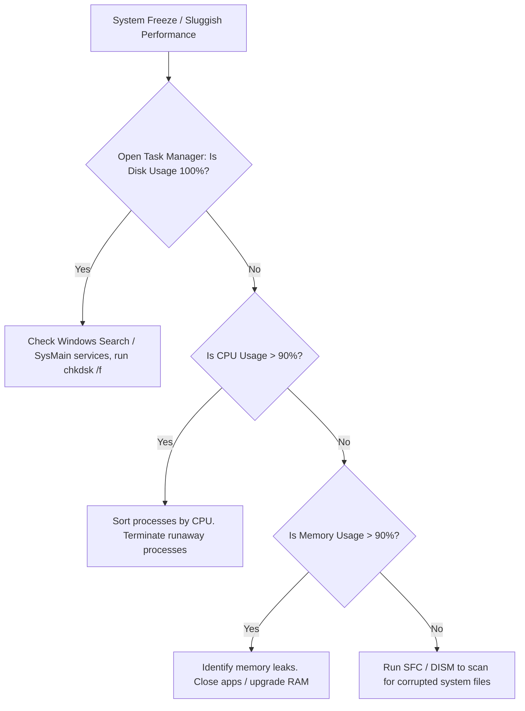

# 02-13 OS Troubleshooting Masterclass

> [!abstract] Overview
> An advanced diagnostic manual for troubleshooting operating system issues. This note covers boot loops, slow system performance, profile corruption, and repairing system files.

---

## Concept Explanation: OS Fault Isolation
When troubleshooting operating systems, look for patterns to isolate issues. Is the problem happening to all users, or only one? Did it start after an update, or after installing software?
*Seedha simple shabdon mein bole toh: OS troubleshooting tab shuru hoti hai jab hardware check ho chuka ho. Jab blue screen aati hai, system achanak slow ho jata hai, ya user login nahi kar pata, toh hum system files ko repair karte hain, startup programs ko check karte hain, aur event viewer logs analyze karte hain.*

---

## OS Diagnostic Flowchart
Use this flowchart to isolate system freezes and performance bottlenecks:



---

## Advanced OS Troubleshooting Procedures

### 1. Rebuilding Corrupted System Files (SFC & DISM)
If Windows experiences frequent Explorer crashes, system settings menu freezes, or missing DLL errors:
1. Open Command Prompt as Administrator.
2. Run DISM to scan the online Windows component store against Microsoft Server databases:
   ```cmd
   dism /online /cleanup-image /restorehealth
   ```
3. Once DISM finishes successfully, run System File Checker to repair local files:
   ```cmd
   sfc /scannow
   ```
4. Restart the computer to apply the repairs.

### 2. Troubleshooting Windows Boot Loops
If Windows fails to boot, restarting automatically before showing the login screen:
1. Boot into the Windows Recovery Environment (WinRE).
2. Select **Troubleshoot** -> **Advanced Options** -> **Startup Settings** -> **Restart**.
3. Press **4** or **F4** to boot the PC in **Safe Mode**.
4. In Safe Mode, open Device Manager and roll back recently updated hardware drivers (e.g., graphics or storage drivers).
5. Open Command Prompt and check for disk errors:
   ```cmd
   chkdsk C: /f /r
   ```

---\n---

## Technical Deep-Dive: Windows Kernel & Service Operations
The Windows operating system relies on the **Windows NT Kernel** to manage hardware interactions, system security, and memory allocations.
- **User Mode vs. Kernel Mode:** Windows operates in two privilege modes. Applications (like Word or Chrome) run in User Mode, where they have restricted access to hardware. The OS kernel, drivers, and core services run in Kernel Mode, with direct access to system memory and hardware. A crash in User Mode only closes the app; a crash in Kernel Mode triggers a BSOD to prevent hardware damage.
- **Windows Boot Sequence:**
  1. **POST:** The system firmware (BIOS/UEFI) initializes hardware.
  2. **Boot Manager:** UEFI reads the EFI System Partition (ESP) and loads `bootmgr.efi`.
  3. **OS Loader:** Loads `winload.efi`, which starts kernel initialization and loads boot-start drivers.
  4. **Kernel Init:** Loads the NT Kernel (`ntoskrnl.exe`), initializes registry configurations, and launches the Session Manager Subsystem (`smss.exe`).
  5. **Logon Screen:** The Local Security Authority Subsystem (`lsass.exe`) starts, and display output shows the logon screen.

## Real-World OS Incident Tickets

### Ticket 1: Corrupted Windows Update Component Store
- **Incident ID:** INC108876
- **Priority:** P3
- **Problem Statement:** "Windows Update fails to install security patches, returning error code 0x800f081f. Trying to retry does nothing."
- **Diagnostics:**
  1. Inspected `%systemroot%\Logs\CBS\CBS.log`. Found multiple errors indicating missing files in the WinSxS directory (Component Store).
  2. Ran `sfc /scannow`, which returned: "Windows Resource Protection found corrupt files but was unable to fix some of them."
- **Resolution:**
  - Ran DISM targeting the online Windows image:
    `dism /online /cleanup-image /restorehealth`
  - DISM successfully repaired the corrupted files using Windows Update servers as the source.
  - Ran `sfc /scannow` again, which now completed with no errors. Restarted the PC and completed Windows Update.

### Ticket 2: Operating System Registry-Based Application Hang
- **Incident Description:** Excel crashes immediately upon startup for a finance user, even when launched in Safe Mode (`excel.exe /safe`).
- **Diagnostics & Resolution:**
  1. Checked Application Event Logs. Found Event ID 1000 (Application Error) pointing to `excel.exe` and faulting module `mso.dll`.
  2. Reinstalling Microsoft Office did not resolve the issue, indicating the problem was in the user profile configuration.
  3. Opened `regedit.exe` and navigated to the Excel user settings:
     `HKCU\Software\Microsoft\Office\16.0\Excel`.
  4. Renamed the `Excel` key to `Excel.old`.
  5. Relaunched Excel. The app recreated the registry keys with default values and started successfully.

## OS Support Interview Q&A Bank
**Q1: What is the purpose of the WinSxS folder in Windows?**
A: The WinSxS (Windows Side-by-Side) folder stores the Windows Component Store, which contains multiple versions of DLLs, drivers, and system files, allowing the OS to recover from file corruption and roll back updates.

**Q2: How do you troubleshoot a Windows machine that boots to a black screen with only a cursor?**
A: Press `Ctrl + Shift + Esc` to open Task Manager. If it opens, click File > Run new task, type `explorer.exe`, and check if the desktop loads. If Task Manager doesn't open, restart the PC in Safe Mode, uninstall recent updates, or roll back graphics drivers.

**Q3: What is the registry and how is it backed up?**
A: The registry is a hierarchical database of system settings. Windows backs up the registry automatically to System Restore points. Support engineers can manually back up keys by exporting them as `.reg` files in the Registry Editor.