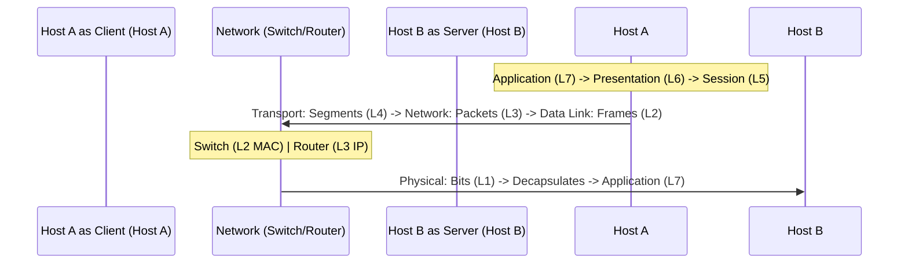

# 03-01 OSI Model (The Complete Guide)

> [!abstract] Overview
> Clear breakdown of the OSI 7-layer networking model, its functions, protocols, and how to apply it as a structured troubleshooting framework.

---

## What Is It? (Concept Explanation)
The Open Systems Interconnection (OSI) model is a conceptual framework that standardizes how data flows from one computer to another over a network.
*Seedha simple shabdon mein: OSI model network connectivity check karne ka step-by-step roadmap hai. Agar physical connection (Layer 1 - cable) kharab hai, toh Layer 7 (Chrome Browser) par website load hone ka sawal hi nahi uthta. Humein hamesha troubleshooting bottom-to-top (Layer 1 se Layer 7) karni chahiye.*

---

## How It Works (Deep Dive)



### The 7 Layers of OSI:
1. **Layer 1 - Physical:** Raw bit transmission over physical medium.
   - *Hardware/Protocols:* RJ45 cables, Fiber, Hubs, Wi-Fi radio frequencies.
   - *Troubleshooting:* Cable plugged in? Port link lights blinking?
2. **Layer 2 - Data Link:** Framing, error detection, physical addressing.
   - *Hardware/Protocols:* MAC addresses, Ethernet switches.
   - *Troubleshooting:* Switch port configuration, MAC filtering.
3. **Layer 3 - Network:** Logical addressing and routing.
   - *Hardware/Protocols:* IPv4, IPv6, ICMP, Routers.
   - *Troubleshooting:* Device getting IP address? Ping gateway?
4. **Layer 4 - Transport:** Segmenting, flow control, reliability (TCP vs UDP).
   - *Hardware/Protocols:* TCP, UDP.
   - *Troubleshooting:* Ports open? Firewall blocking TCP traffic?
5. **Layer 5 - Session:** Establishes and manages connections.
   - *Hardware/Protocols:* NetBIOS, PPTP.
   - *Troubleshooting:* Keep-alive issues, persistent login dropouts.
6. **Layer 6 - Presentation:** Formatting, encrypting, and compressing data.
   - *Hardware/Protocols:* SSL/TLS, ASCII, JPEG, Encryption.
   - *Troubleshooting:* SSL/TLS handshake failures, certificate errors.
7. **Layer 7 - Application:** User interaction interface.
   - *Hardware/Protocols:* HTTP, HTTPS, SMTP, DNS, FTP.
   - *Troubleshooting:* Browser cache issues, application settings.

---

## Real-World Scenarios
**Scenario 1:** A user complains they cannot open the corporate HR portal on Chrome.
- Problem: Portal displays "Site cannot be reached."
- Layered Diagnosis:
  - *Layer 1:* Checked LAN cable (Green light is on).
  - *Layer 3:* Run `ipconfig` (PC has local IP `192.168.1.15`).
  - *Layer 3:* Pinging gateway `192.168.1.1` succeeds.
  - *Layer 7:* Pinging domain name of portal fails, but pinging IP succeeds (indicates DNS failure).
- Solution: Configure correct internal DNS server IPs in Network Adapter settings.

---

## Step-by-Step Troubleshooting Guide
1. **Start at Layer 1:** Check if the network cable is plugged in or Wi-Fi is toggled ON.
2. **Move to Layer 2:** Check if the network interface card (NIC) is enabled in Windows (`ncpa.cpl`).
3. **Verify Layer 3:** Run `ipconfig` to verify the PC has received a valid IP address (not `169.254.x.x` APIPA).
4. **Test Layer 4/7:** Use `telnet` or `Test-NetConnection` in PowerShell to verify if the server's application port (like 80/443) is open.

---

## Important Commands / Shortcuts
```cmd
:: Test basic Layer 3 connectivity
ping 8.8.8.8
:: Trace path packet takes across Layer 3 routers
tracert google.com
```

---

## Quick Revision Summary
| Layer | Name | Core Address/Device |
|---|---|---|
| 7 | Application | Browser / HTTP |
| 4 | Transport | Ports / TCP & UDP |
| 3 | Network | IP Address / Routers |
| 2 | Data Link | MAC Address / Switches |
| 1 | Physical | Cables & Hubs |

---

## Interview Q&A Bank
**Q1: How do you use the OSI model to troubleshoot a user who cannot connect to the internet?**
A: I start at Layer 1 by verifying the physical connections (cables/LED link lights). Then I check Layer 3 by running `ipconfig` to ensure the device has a valid IP address. If it does, I check Layer 3 connectivity by pinging the default gateway. Lastly, I test Layer 7 by checking DNS resolution using `nslookup`.

---

## Real-World OSI Layer Mapping Case Study
When a user launches a web page (e.g. `https://google.com`), the data packet traverses the entire OSI stack:
- **Layer 7 (Application):** Chrome formats the HTTP/HTTPS request header.
- **Layer 6 (Presentation):** SSL/TLS encryption wraps the HTTP stream.
- **Layer 5 (Session):** Establishes the TCP connection state.
- **Layer 4 (Transport):** Segment is assigned source/destination TCP ports (e.g. Port 443).
- **Layer 3 (Network):** IP headers are added, defining the target server IP address.
- **Layer 2 (Data Link):** MAC addresses are stamped onto the frame.
- **Layer 1 (Physical):** The local NIC converts the frame into physical light signals sent over fiber.

## Related Notes
- [[03-08 Network Diagnostic Commands]]
- [[08-06 Network Connectivity Troubleshooting]]