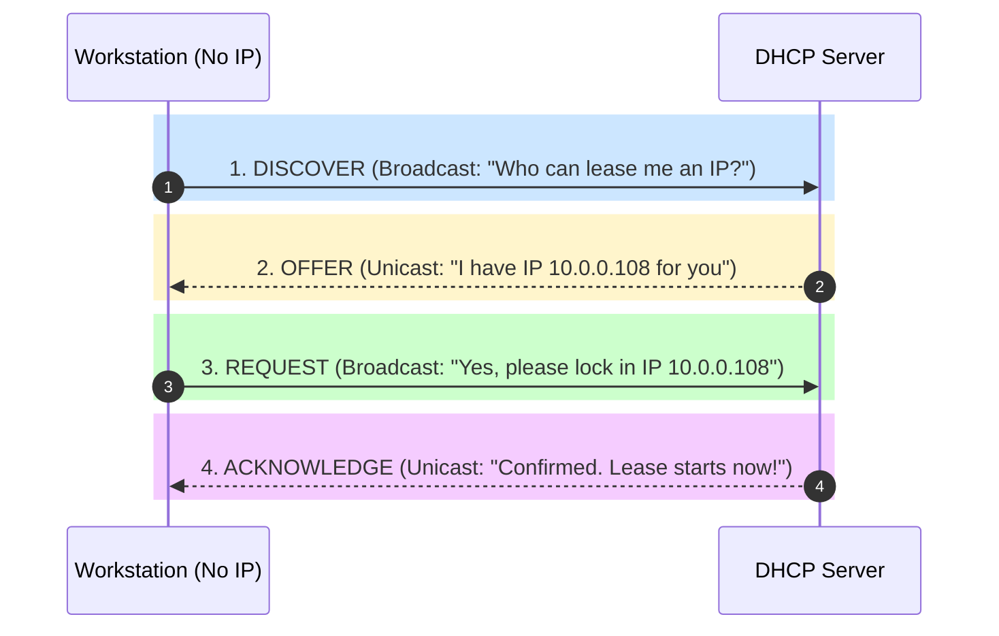

# 03-03 Core Network Protocols

> [!abstract] Overview
> A comprehensive guide to core TCP/IP protocols used in desktop support. This note covers the operations and troubleshooting workflows of DHCP, DNS, TCP/UDP, and ICMP in corporate networks.

---

## 1. What Is It? (Concept Explanation)
Networking protocols govern how data packets are sent, routed, and resolved across domains.



Network protocols are standardized sets of rules that govern how data is formatted, transmitted, and received across a network. They allow different devices to communicate seamlessly.
*Seedha simple shabdon mein bole toh: Network protocols computers ke beech ki language rules hain. Jaise do log aapas mein baat karne ke liye ek language (jaise Hindi ya English) use karte hain, waise hi computers aapas mein communicate karne ke liye protocols ka use karte hain. Agar ek bhi core protocol (jaise DNS ya DHCP) fail ho jaye, toh system internet se disconnect ho jata hai aur communications band ho jaati hain.*

---

## 2. Technical Operations of Core Protocols

### 1. DHCP (Dynamic Host Configuration Protocol)
DHCP automates the assignment of IP addresses, subnet masks, gateways, and DNS servers. It operates on UDP ports `67` (server) and `68` (client) using the **DORA** process:
- **Discover:** The client broadcasts a DHCPDISCOVER packet on the local network to find available DHCP servers.
- **Offer:** DHCP servers respond with a DHCPOFFER packet containing an available IP address configuration.
- **Request:** The client selects an offer and broadcasts a DHCPREQUEST packet to lock in the lease.
- **Acknowledge:** The server confirms the lease with a DHCPACK packet, and the client applies the configurations.

### 2. DNS (Domain Name System)
DNS translates domain names (e.g., `google.com`) into IP addresses (e.g., `142.250.190.46`). It operates on Port `53` (TCP/UDP).
- **DNS Resolution Process:** When a user opens a URL, the local resolver checks its cache. If not found, it queries the local DNS server, which recursively queries Root, TLD, and Authoritative Name Servers to resolve the IP address.

### 3. TCP vs. UDP
- **TCP (Transmission Control Protocol):** Connection-oriented. It establishes a connection using a 3-way handshake (SYN, SYN-ACK, ACK), verifies packet delivery, and retransmits lost packets. Used for web browsing (HTTP/S), email, and file transfers (SMB).
- **UDP (User Datagram Protocol):** Connectionless. It sends packets without establishing a connection or verifying delivery, prioritizing speed over reliability. Used for VoIP, video calls, and media streaming.

---

## 3. Real-World Support Scenarios

### Scenario 1: Resolving Stale DNS Cache Errors
- **Incident Description (Situation):** An employee reports they cannot access the new corporate intranet page (`intranet.corp.local`), receiving a "Server Not Found" error. Other users on the same floor can access the page.
- **Diagnosis (Action):**
  1. Open Command Prompt on the user's PC.
  2. Run a DNS lookup check:
     ```cmd
     nslookup intranet.corp.local
     ```
  3. The query returns the old server IP address (`10.10.1.50`). The server was migrated to `10.10.2.50` last night.
  4. Explain to the user that their local DNS resolver cache is holding stale address data.
- **Resolution (Result):**
  1. Clear the local DNS cache:
     ```cmd
     ipconfig /flushdns
     ```
  2. Verify the cache is cleared and query again:
     ```cmd
     nslookup intranet.corp.local
     ```
  3. The command now returns the correct IP address (`10.10.2.50`), and the intranet page loads successfully.

### Scenario 2: Troubleshooting a DHCP Scope Exhaustion Outage
- **Incident Description (Situation):** Dozens of wireless users in the main office lobby report they are disconnected from the internet and cannot obtain an IP address.
- **Diagnosis & Resolution (Action):**
  1. Audit a disconnected laptop. `ipconfig` shows an APIPA address (`169.254.22.84`).
  2. Verify network connectivity to the DHCP server. It pings successfully.
  3. Log on to the DHCP server console. Inspect the active Scope lease pool for `VLAN-30-Wireless`.
  4. The scope shows 100% lease utilization (0 IP addresses free). This is caused by temporary guest devices exhausting the available IP pool.
- **Resolution:**
  - Increase the DHCP scope pool range by expanding the subnet prefix (e.g., from a `/24` to a `/23` subnet).
  - Reduce the DHCP lease time for the wireless scope from 8 days to 4 hours to release inactive IP addresses sooner.

---

## 4. Related Notes
- [[03-02 IP Addressing & Subnetting]] - IP network boundaries
- [[03-04 Network Ports Master Reference]] - Port mappings
- [[12-03 Network Ports Reference Table]] - Port reference lists

## Advanced DHCP Options for Corporate Networks
DHCP servers utilize Options parameters to distribute configuration details to network clients, going beyond simple IP address allocation.

### Standard Corporate DHCP Options List
- **Option 3 (Router):** Specifies the IPv4 default gateway address for the local subnet.
- **Option 6 (DNS Servers):** Allocates the IP addresses of the primary and secondary domain DNS servers.
- **Option 15 (Domain Name):** Sets the default connection suffix (e.g. `company.local`) for short-name DNS queries.
- **Option 66 (TFTP Server Name):** Identifies the host name of the PXE deployment server.
- **Option 150 (TFTP Server IP):** Allocates the IP address of Cisco TFTP boot servers for office VoIP phones.

### The DHCP DORA Lease Process
Clients obtain IP leases using the 4-step DORA exchange process:
1. **Discovery (Broadcast):** Client queries the network to locate an active DHCP server.
2. **Offer (Unicast):** Servers offer an available IP address configuration.
3. **Request (Broadcast):** Client requests the offered IP from the responding server.
4. **Acknowledgement (Unicast):** Server commits the IP lease and sends configuration parameters.
Subnet lease duration is typically set to 8 days for desk PCs, and 8 hours for guest Wi-Fi networks to prevent IP address pool exhaustion.