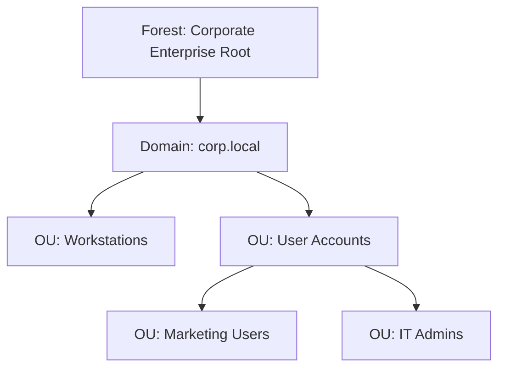

# 04-01 Active Directory Fundamentals

> [!abstract] Overview
> A guide to Active Directory (AD) Domain Services. This note covers domains, domain controllers, organizational units (OUs), active directory schemas, and the standard LDAP lookup protocols.

---

## 1. What Is It? (Concept Explanation)
Active Directory (AD) is a directory service developed by Microsoft for Windows domain networks. It manages users, computers, printers, and security permissions across an organization.
*Seedha simple shabdon mein bole toh: Active Directory company ke employee database ki tarah hai. Jab aap company ke computer par apna user ID aur password daal kar login karte hain, toh computer Active Directory server (Domain Controller) se validation leta hai ki password sahi hai ya nahi aur aapko kya privileges (access) milne chahiye.*

---

## 2. Active Directory Hierarchy
Active Directory is organized hierarchically:



1. **Forest:** The top-level logical container in an Active Directory configuration, grouping all domains.
2. **Domain:** A logical group of network objects (computers, users, printers) that share a common directory database. (e.g., `corp.local`).
3. **Domain Controllers (DC):** Servers running AD Domain Services. They validate logins, store the directory database, and replicate changes across the network.
4. **Organizational Units (OUs):** Containers within a domain used to organize resources and delegate permissions or link Group Policy Objects (GPOs).

---

## 3. Real-World Scenarios

### Scenario 1: Trust Relationship Failed Error on Client Boot
- **Incident Description:** A user powers on their corporate desktop, attempts to log in, and receives the error: "The trust relationship between this workstation and the primary domain failed."
- **Troubleshooting Steps:**
  1. Explain that this error happens when the computer's local machine account password desynchronizes with the password stored in Active Directory. This often occurs if a laptop is powered off for months.
  2. Log on to the client machine using the local administrator account (not the domain account).
  3. Check the network connection (verify you can ping the Domain Controller).
  4. Open PowerShell as Administrator and run the repair cmdlet:
     ```powershell
     # Test and repair the secure channel link to the domain controller
     Test-ComputerSecureChannel -Repair -Credential (Get-Credential)
     ```
  5. Enter domain administrator credentials when prompted.
- **Resolution:** Re-established the secure domain trust link, restarted the computer, and verified the user could log in with their corporate credentials.

---

## 4. Useful AD Administration Shortcuts
Desktop support engineers use these MMC shortcuts to manage directory resources:

- `dsa.msc` : Opens **Active Directory Users and Computers (ADUC)**.
- `gpmc.msc` : Opens the **Group Policy Management Console**.
- `eventvwr.msc` : Opens Event Viewer (useful for checking domain authentication logs).

---
## 2. Technical Deep-Dive: NTDS.dit & Active Directory Schema
Active Directory Domain Services (AD DS) stores its directory database in a single database file named `ntds.dit`, located in `%systemroot%\NTDS\`.
- **Active Directory Schema:** The master rulebook that defines the classes (e.g., user, computer, group) and attributes (e.g., telephone number, department) that can exist in the AD database. The schema is forest-wide, meaning all domains in a forest share the same definitions.
- **Global Catalog (GC):** A Domain Controller that stores a full replica of all objects in its local domain database, plus a partial, read-only copy of all objects in other domains in the forest. This enables users to locate resources in other domains quickly.
### Ticket 1: Domain Controller Replication Sync Lag
- **Incident ID:** INC104192
- **Priority:** P3
- **Problem Statement:** "I reset a user's password on DC-01, but when they try to log on in the branch office, they get 'Wrong Password' errors."
- **Diagnostics:**
  1. Verified the password reset succeeded on DC-01.
  2. Checked which Domain Controller authenticated the branch user's login attempt:
     ```cmd
     echo %logonserver%
     ```
     The output showed `\\DC-02` (located in the branch office).
  3. Ran Active Directory replication check tool:
     ```cmd
     repadmin /syncall
     ```
     The tool showed replication between DC-01 and DC-02 was lagging due to high WAN network latency.
- **Resolution:** Manually forced database replication between the Domain Controllers using the `repadmin` command. Verified DC-02 updated, and the user successfully logged on.
### Active Directory Replication Status Diagnostics (CMD)
```cmd
:: Check replication summary for all Domain Controllers
repadmin /replsummary

:: Force immediate replication from source DC to destination DC
repadmin /syncall /AeD
```
**Q1: What is the difference between an Active Directory Domain and an Active Directory Forest?**
A: A Domain is a logical grouping of network objects (users, computers, printers) sharing a common database and security policies. A Forest is the ultimate organizational security boundary, containing one or more domain trees that share a common Schema, Configuration partition, and Global Catalog.

**Q2: What is the role of the NTDS.dit file in Active Directory?**
A: `ntds.dit` is the database file that stores all Active Directory directory data, including user accounts, passwords, security groups, computer objects, and organization structural schemas. It is stored on Domain Controllers.

## Related Notes
- [[04-02 User Account Management in AD]] - AD User administration
- [[04-05 Group Policy for Support Engineers]] - GPOs deployment