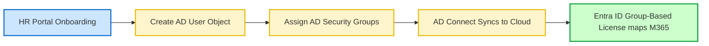

# 04-02 User Account Management in AD

> [!abstract] Overview
> A guide to managing Active Directory user accounts. This note details creating users, password resets, unlocking locked-out accounts, and adjusting group memberships.

---

## 1. What Is It? (Concept Explanation)
User account management is the creation, lifecycle monitoring, and access configuration of user objects in directory systems.



User account management is one of the most common tasks in desktop support. It includes creating new user accounts, updating account details, resetting passwords, and modifying security groups.
*Seedha simple shabdon mein bole toh: Jab bhi koi naya employee company join karta hai, unka account AD mein banta hai. Jab woh password bhool jaate hain, toh unka account lock ho jata hai. support engineers ko ADUC console (`dsa.msc`) ka use karke accounts ko unlock, reset aur modify karna hota hai.*

---

## 2. Standard Support Tasks in ADUC

### 1. Resetting Passwords
- Locate the user account in **Active Directory Users and Computers** (`dsa.msc`).
- Right-click the user -> select **Reset Password**.
- Set a temporary password and check the box: **User must change password at next logon**.

### 2. Unlocking Accounts
- Accounts lock automatically after a set number of failed login attempts (defined by the domain security policy).
- Open the user's properties in ADUC, click the **Account** tab, and check **Unlock account. This account is currently locked out on this Active Directory Domain Controller**. Click Apply.

### 3. Managing Security Groups
- Add users to security groups (like `HR-Department-Share` or `VPN-Access-Group`) to manage folder and network access.
- Go to the user's properties, click the **Member Of** tab, click **Add**, type the group name, and click check names.

---

## 3. Real-World Scenarios

### Scenario 1: Locked Out Account Due to Cached Credentials
- **Incident Description:** A manager reports their Active Directory account keeps locking out every 15 minutes, even after you reset their password and unlock it.
- **Troubleshooting Steps:**
  1. Open Event Viewer on the domain controller or run lock-out tools to identify the device causing the lockouts.
  2. The lockout source is the manager's corporate smartphone.
  3. Explain that the mobile device is still trying to sync email using their old cached password. After several sync attempts, it locks the AD account.
- **Resolution:**
  - Clear the cached password on the user's smartphone, input the new password, and verify the email app syncs without triggering lockouts.

---

## 4. Command Line AD Operations
Use administrative PowerShell cmdlets to query AD account status:

```powershell
# Check if a user account is locked (PowerShell)
Get-ADUser -Identity "rohan.sharma" -Properties LockedOut | Select-Object Name, LockedOut

# Unlock an Active Directory user account (PowerShell)
Unlock-ADAccount -Identity "rohan.sharma"

# Add a user to a specific Active Directory security group
Add-ADGroupMember -Identity "VPN-Users-Group" -Members "rohan.sharma"
```

---
## 2. Technical Deep-Dive: User Attributes & Account Lockouts
In Active Directory, user objects have hundreds of properties (attributes) stored in the database. Key security attributes include:
- **sAMAccountName:** The pre-Windows 2000 logon name (e.g., `rohans`).
- **UserPrincipalName (UPN):** The internet-style login username (e.g., `rohan.sharma@company.com`).
- **userAccountControl:** A 32-bit flag that controls account states (e.g., `512` = Enabled, `514` = Disabled, `66048` = Password Never Expires).
- **Lockout Duration:** Configured via Group Policy, defining how long an account remains locked (typically 15 or 30 minutes) after exceeding bad password thresholds.
### Ticket 1: Identifying Account Lockout Source via Event Viewer
- **Incident ID:** INC104255
- **Priority:** P3
- **Problem Statement:** "My AD account keeps getting locked out. I unlock it, but within 10 minutes it locks again."
- **Diagnostics:**
  1. Logged into the primary Domain Controller.
  2. Opened Event Viewer, went to Security Logs, and filtered for Event ID `4740` (Account Locked Out).
  3. Found the event logs matching the user's account name.
  4. Inspected the **Caller Computer Name** field in the event details. It pointed to `LAP-MKT-05` (the user's old tablet).
- **Resolution:** Contacted the user. Found they had left their old tablet turned on in their desk drawer. The tablet was running an old Outlook session that was sending failed password requests in the background, locking the account. Cleared the credentials on the tablet to resolve the issue.
### Manage AD User Accounts via PowerShell (ActiveDirectory Module)
```powershell
# Unlock an active directory user account
Unlock-ADAccount -Identity "rohan.sharma"

# Check if a user account is currently locked out
Get-ADUser -Identity "rohan.sharma" -Properties LockedOut | Select-Object Name, LockedOut
```
**Q1: How do you identify the physical device causing an Active Directory user account lockout?**
A: I log on to the Domain Controller and open Event Viewer. I go to Windows Logs > Security, and filter for Event ID `4740`. I look at the latest lockout event for the user and read the **Caller Computer Name** field, which identifies the hostname or IP address of the device sending the failed authentication requests.

**Q2: What is the difference between sAMAccountName and UserPrincipalName (UPN)?**
A: `sAMAccountName` is a legacy Windows attribute limited to 20 characters (e.g. `domain\rohans`). `UserPrincipalName` is the modern internet-style logon format (e.g. `rohans@company.com`) utilized for federated cloud logons and M365 authentication.

## Related Notes
- [[13-04 Password Reset SOP]] - Password reset procedures
- [[04-03 Group Management]] - Group properties