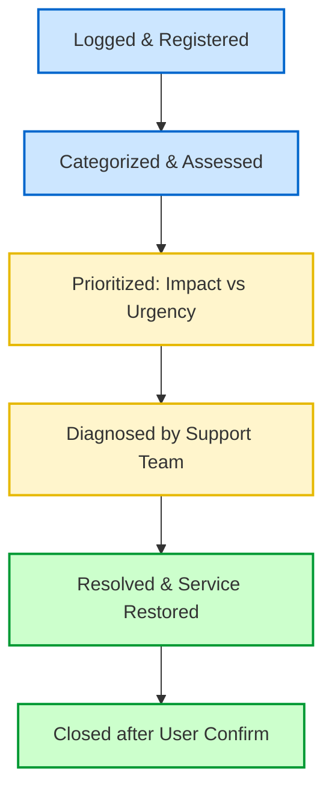
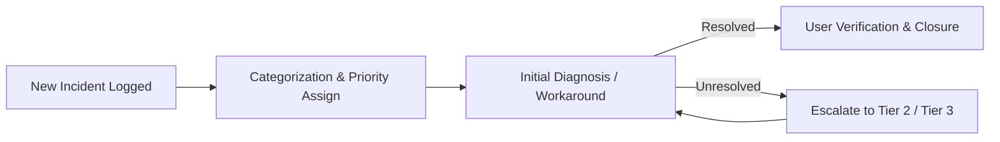

# 05-02 Incident Management

> [!abstract] Overview
> A guide to the Incident Management lifecycle. This note covers ticket logging, priority mapping (Impact vs. Urgency), escalation paths, and SLA target tracking.

---

## 1. What Is It? (Concept Explanation)
Incident Management restores normal service operations as quickly as possible.

An **Incident** is an unplanned interruption to an IT service or a reduction in its quality. The primary goal of Incident Management is to restore normal service operations as quickly as possible, minimizing business impact.
*Seedha simple shabdon mein bole toh: Jab koi cheez toot jaati hai ya kaam nahi karti (jaise printer stop hona, email open na hona, ya windows corrupt hona), use Incident kehte hain. Incident management ka matlab hai us issue ko ticket ke roop mein log karna aur user ka kaam jaldi se jaldi chalu karwana.*

---

## 2. The Incident Lifecycle Flow

1. **Identification & Logging:** The incident is reported via self-service portal, email, phone, or chat, creating a ticket in the system.
2. **Categorization:** Assigning the correct category (e.g., *Hardware > Laptop > Display*) to route the ticket to the correct queue.
3. **Prioritization (Impact vs. Urgency):**
   - **Impact:** The number of users or business operations affected.
   - **Urgency:** How quickly the business needs the resolution.
   - *Formula:* **Priority (P1 to P4) = Impact x Urgency**
4. **Diagnosis & Resolution:** The support engineer applies a workaround or permanent fix.
5. **Closure:** Confirming resolution with the user before resolving the ticket.

---

## 3. Real-World Scenarios

### Scenario 1: Managing a P1 Outage (Exchange Sync Down)
- **Incident Description:** The head of operations reports that all users on the 3rd floor are unable to send or receive emails.
- **Troubleshooting Steps:**
  1. Evaluate the **Impact**: The entire 3rd floor (50+ users) is affected. The business impact is high.
  2. Evaluate the **Urgency**: Email communication is critical for operations. The urgency is high.
  3. Determine the **Priority**: High Impact x High Urgency = **P1 (Critical Incident)**.
  4. Initiate the P1 response protocol: Log a parent incident ticket, alert the messaging and network teams, and post an update on the internal IT status page.
- **Resolution:**
  - The network team identified a failed port on the core floor switch.
  - Re-routed the network connection to a backup switch. Verified email sync restored for the users, updated the parent ticket, and closed all linked child tickets.

---
## 2. Technical Deep-Dive: Incident Lifecycle & Priorities
Incident Management is the practice of restoring normal service operations as quickly as possible. The incident lifecycle consists of:
1. **Identification & Logging:** Ticket created via user portal or monitoring alert.
2. **Categorization:** Classifying the issue (e.g., Hardware > Laptop > Keyboard).
3. **Prioritization:** Calculated using Impact (number of affected users) and Urgency (business importance of the system).
4. **Initial Diagnosis:** Technical support runs troubleshooting steps.
5. **Resolution & Recovery:** Restoring service using workarounds or permanent fixes.
6. **Closure:** Confirming with the user that the issue is resolved.
### Ticket 1: Handling a VIP Critical Incident
- **Incident ID:** INC105221
- **Priority:** P1 (Critical Outage)
- **Problem Statement:** "The CEO's laptop displays a blue screen during boot, and they have an investor presentation starting in 10 minutes."
- **Action Plan:**
  1. Acknowledged the incident immediately (Response SLA met in <1 minute).
  2. Retrieved a pre-staged replacement laptop of the same model from the IT build room.
  3. Walked to the CEO's office, logged them into the replacement laptop, and verified their OneDrive files had synchronized.
- **Resolution:** Restored the CEO's workspace within 8 minutes using the backup laptop, resolving the incident. Checked in the failed laptop for motherboard diagnostics.
### Ticket Priority Calculation Matrix

| Urgency \ Impact | High (All Users) | Medium (Dept) | Low (Single User) |
|---|---|---|---|
| **High (Critical Business)** | P1 - Critical | P2 - High | P3 - Moderate |
| **Medium (Normal Ops)** | P2 - High | P3 - Moderate | P4 - Low |
| **Low (Non-Urgent)** | P3 - Moderate | P4 - Low | P4 - Low |
**Q1: How do you determine the priority of a support ticket?**
A: Priority is determined by multiplying the **Impact** (how many users or business processes are affected) by the **Urgency** (how quickly the business requires a resolution). A system outage affecting the main ERP database is a P1, while a single user with a flickering screen is a P3.

## Major Incident Management Procedures
A Major Incident is a P1 critical outage that halts business operations (e.g., core database offline):
1. **Emergency Bridge:** Support teams set up an emergency bridge call (Teams meeting) with Tier 3 engineers.
2. **Stakeholder Communication:** Run automated email alerts to users every 30 minutes.
3. **PIR meeting:** Once service is restored, hold a Post-Incident Review to identify preventative actions.

## Related Notes
- [[05-09 SLA Management & Reporting]] - SLA target frameworks
- [[05-05 Ticketing Systems]] - Ticket lifecycle controls