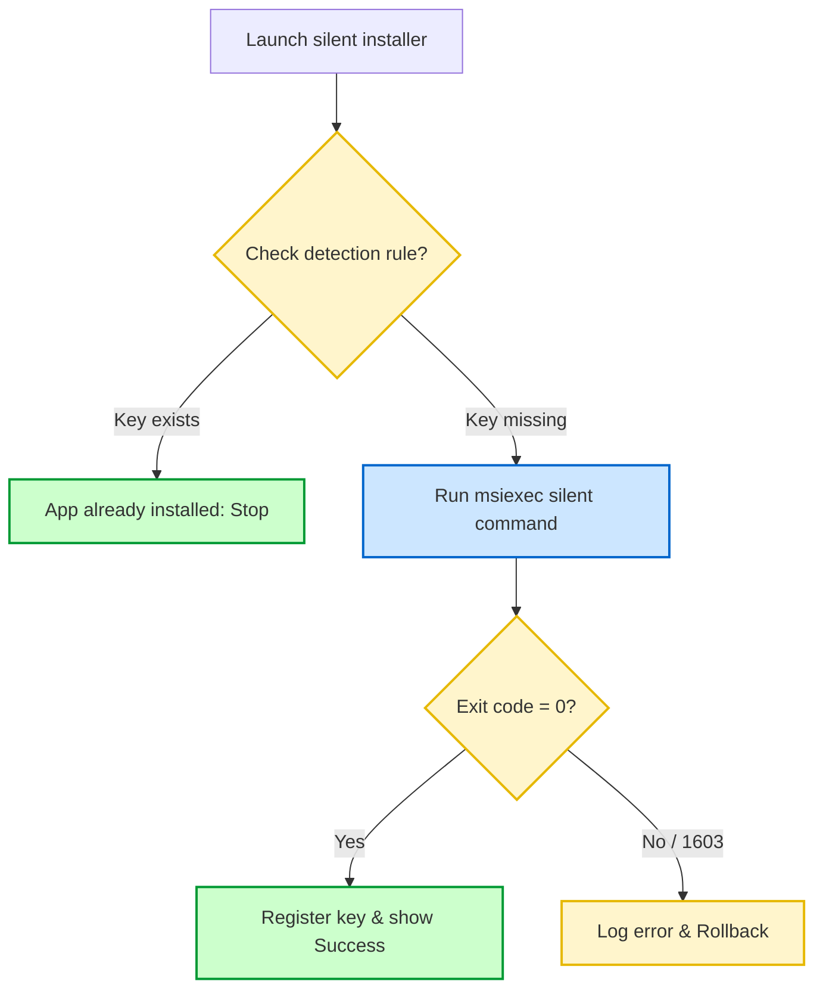

# 06-05 Software Installation & Management

> [!abstract] Overview
> A guide to software deployment and installation for support engineers. This note covers silent install switches, MSI vs. EXE installers, command-line installations, and cleaning corrupted installations.

---

## 1. What Is It? (Concept Explanation)
Software deployment is the process of distributing installer packages silently across domain workstations.



Software installation in enterprise environments is typically managed centrally or via command line. Understanding installer file types and command-line switches allows for automated, consistent software setups.
*Seedha simple shabdon mein bole toh: Enterprise computers par software manually double-click karke install nahi kiya jata. Hum silent install switches ka use karte hain taaki process background mein run ho aur user ko options select na karne padein. Isme winget commands aur system registry logs cleaning tools ka use kiya jata hai.*

---

## 2. MSI vs. EXE Installers
- **MSI (Microsoft Installer):** A standard Windows installer package database format. It natively supports silent installations, installation logging, and automated rollbacks if the installation fails.
- **EXE (Executable):** A custom program wrapper. To run a silent install on an EXE, you must research the developer's custom command-line switches (e.g., `/S`, `/silent`, `/q`).

---

## 3. Standard Silent Installation Command Switches

| Installer Format | Command Line Example | Switch Meanings |
|---|---|---|
| **MSI Package** | `msiexec /i "chrome.msi" /qn /norestart` | `/i` = Install, `/qn` = Quiet No-GUI, `/norestart` = Block restarts. |
| **InstallShield EXE** | `setup.exe /s /v"/qn"` | `/s` = Silent execution, `/v` = Pass parameters to internal MSI. |
| **Inno Setup EXE** | `setup.exe /VERYSILENT /SUPPRESSMSGBOXES` | Run installer in background, suppress warning popups. |

---

## 4. Managing Software via PowerShell
Use the built-in Windows Package Manager (`winget`) to install and update applications via command line:

```cmd
:: Search for an application in the repository (CMD)
winget search "7-Zip"

:: Install 7-Zip silently (CMD)
winget install --id 7zip.7zip --silent --accept-source-agreements

:: Update all installed software applications (CMD)
winget upgrade --all
```

---
## 2. Technical Deep-Dive: MSI Database Tables & Registry Keys
Windows Installer (`msiexec.exe`) uses Microsoft Installer (MSI) database packages to manage software:
- **MSI database:** A relational database containing tables for files, registry entries, dependencies, and shortcuts.
- **Silent Installation Switches:** Allow administrators to deploy software silently using tools like Intune or SCCM:
  - `/i` : Initiates installation.
  - `/qn` : Run quiet with no user interface (silent).
  - `/norestart` : Blocks automatic reboots.
- **Registry Registration:** Installed software registers details under:
  `HKLM\SOFTWARE\Microsoft\Windows\CurrentVersion\Uninstall`
### Ticket 1: Failed Software Installation due to Stale Registry Keys
- **Incident ID:** INC106509
- **Priority:** P3
- **Problem Statement:** "When trying to install Cisco Webex, the installer crashes with error: 'A newer version is already installed', although Webex is not in Control Panel."
- **Diagnostics:**
  1. Audited the registry path: `HKLM\SOFTWARE\Microsoft\Windows\CurrentVersion\Uninstall`.
  2. Found a stale Webex registry key left behind after a previous failed uninstall.
  3. The MSI installer read this key and assumed the software was active.
- **Resolution:** Exported the key for backup, deleted the stale Webex registry key, and ran the MSI silent install command. The installation completed successfully.
### Execute Silent MSI Software Installation (CMD)
```cmd
:: Install application silently with verbose logging
msiexec /i "setup.msi" /qn /norestart /L*V "C:\temp\install.log"
```
**Q1: What is the difference between an MSI and an EXE installer package?**
A: An MSI package is a standardized Windows Installer database file that supports silent installation switches, rollback plans, and clean registry registration. An EXE installer is a custom executable that runs its own setup routines, making it harder to automate silently.

## Troubleshooting Installer Error Code 1603
The Windows installer error `1603` is a generic failure code. Technicians isolate the cause by:

### Step-by-Step 1603 Diagnostic Checklist
1. **Audit Logs:** Run the installer with verbose logging parameters enabled:
   `msiexec /i setup.msi /qn /L*V C:\temp\install.log`
   Search the `install.log` file for the string **Return Value 3** (where the failure started).
2. **Verify System Permissions:** Ensure the `SYSTEM` account has Full Control permissions on the target installation folder (e.g., `C:\Program Files`).
3. **Registry Check:** Clean up stale registry keys from previous installations of the app under:
   `HKLM\SOFTWARE\Microsoft\Windows\CurrentVersion\Uninstall`
4. **Local Storage:** Ensure the client hard drive has sufficient storage space to unpack the temporary MSI files.

## Additional Pro-Tips for Application Deployment
When deploying software packages through enterprise configuration engines (like SCCM or Intune), technicians must verify the application's 'Detection Method'. A detection method checks if the app is already installed by looking for a specific registry key value (under HKLM Software) or file path. If the detection rule is configured incorrectly, the agent will reinstall the software in a loop or report a failure even if the installation succeeded.

## Related Notes
- [[10-02 Microsoft Intune Basics]] - App packaging deployments
- [[12-02 CMD & PowerShell Commands Cheat Sheet]] - Administrative scripts