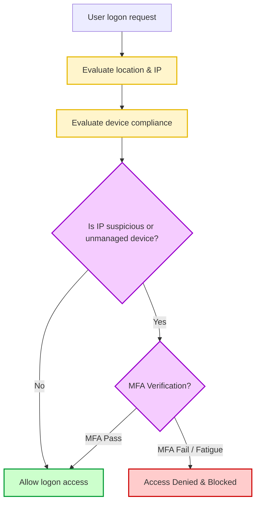

# 07-06 Password Security & MFA

> [!abstract] Overview
> A guide to managing password policies and Multi-Factor Authentication (MFA) in an enterprise domain. This note covers authentication factors, Microsoft Entra ID MFA controls, and resolving MFA lockouts.

---

## 1. What Is It? (Concept Explanation)
Identity security protects domain access credentials through multi-factor validation.

Authentication security ensures that only verified users can log on to corporate networks. This involves enforcing strong password policies and requiring Multi-Factor Authentication (MFA) to block credential attacks.
*Seedha simple shabdon mein bole toh: Password security aur MFA corporate accounts ki security keys hain. Single password ko hacker leak ya guess kar sakte hain, isliye hum phone app ya hardware token (MFA) ka use karte hain. Agar user phone badalta hai, toh local token disconnect ho jata hai aur humein admin panel se MFA reset karna padta hai.*

---

## 2. Technical Deep-Dive: Authentication Factors & MFA Loops
Authentication relies on proving identity through multiple categories of proof:

### The Three Authentication Factors
1. **Something You Know:** A password, PIN, or passphrase.
2. **Something You Have:** A smartphone (Authenticator app), physical hardware key (YubiKey), or security token.
3. **Something You Are:** Biometric data (fingerprint, facial recognition).
- **True MFA** requires combining two or more *different* factors (e.g. password + push notification). Using two passwords is not MFA.

### Conditional Access Policies (CAPs)
In Microsoft Entra ID (Azure AD), Conditional Access evaluates signal logs during login:
- **Parameters evaluated:** User location, device compliance (Intune joined), IP address, and application.
- **Action:** If a user logs in from an anomalous country or unmanaged device, the policy prompts for MFA or blocks access entirely.

---

## 3. Real-World Support Scenario (STAR Ticket)
- **Situation:** A user reports they are blocked by an Microsoft 365 login loop. When logging in, the browser prompts for an Authenticator app code, but their smartphone does not receive the notification. They recently replaced their phone.
- **Task:** Reset the user's Multi-Factor Authentication registry, allow them to register their new phone, and restore access.
- **Action:**
  1. Verified the user's identity via video call (checking company ID badge) to prevent social engineering attacks.
  2. Logged into the **Microsoft Entra admin portal** using administrator credentials.
  3. Searched for the user account and navigated to the **Authentication Methods** configuration tab.
  4. Selected **Require re-register multifactor authentication**. This command invalidates the user's old phone keys.
  5. Had the user open `portal.office.com` on their computer.
  6. The portal prompted them to download the Microsoft Authenticator app and scan a QR code to register their new phone.
- **Result:** The user successfully registered their new phone and logged into their email, resolving the access loop.

---

## 4. Multi-Factor Authentication Methods Comparison

| MFA Method | Security Level | Resistance to Phishing | Common Troubleshooting |
|---|---|---|---|
| **SMS/Voice Code** | Low | Vulnerable to SIM-Swapping | Cellular signal issues. |
| **Authenticator App** | Medium | Susceptible to MFA Fatigue | Out of sync system time on phone. |
| **FIDO2 Hardware Key** | High | Fully Phishing Resistant | USB port hardware driver issues. |

---

## 5. Frequently Asked Questions (FAQ)

**Q1: What is MFA fatigue (prompt spamming) and how do we prevent it?**
A: It is an attack where hackers repeatedly trigger MFA push requests to a user's phone, hoping the user will click "Approve" out of frustration. We prevent this by enabling **Number Matching** in Microsoft Entra, requiring the user to type the number shown on their computer screen into their phone.

**Q2: What should I do if a user loses their phone and cannot pass MFA?**
A: Log into the Microsoft Entra admin portal, generate a **Temporary Access Pass (TAP)** (a one-time passcode valid for a set time limit, e.g., 2 hours), and provide it to the user. This allows them to bypass MFA to register their new device.

**Q3: How does Windows Hello for Business work?**
A: It replaces passwords with strong two-factor authentication on local devices. It combines a hardware PIN or biometric check (something you are/know) with the physical TPM chip on the motherboard (something you have) to unlock Windows.

**Q4: Can I reset a user's domain password and MFA tokens from local Active Directory?**
A: Local Active Directory manages domain passwords (which sync to the cloud via Microsoft Entra Connect). However, cloud-only MFA settings must be managed in the Entra ID Admin Portal.

---

## Defending against Session Hijacking and Token Theft
Even with MFA active, hackers can bypass authentication using token theft:
- **Session Hijacking:** Attackers steal the browser active session cookies, allowing them to clone the logged-on state on another PC.
- **Defense:** Enforce Conditional Access Policies that expire browser sessions every 12 hours or restrict cloud access to Intune-compliant devices.

## Related Notes
- [[13-04 Password Reset SOP]] - Password reset verification SOP
- [[04-02 User Account Management in AD]] - User account configurations
- [[07-01 Security Fundamentals (CIA Triad)]] - Access control structures