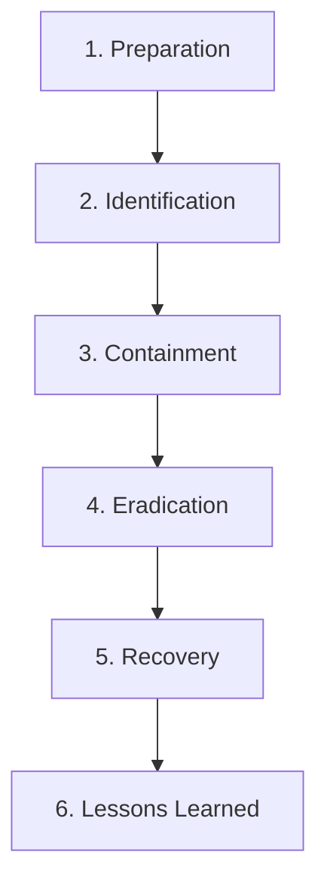

# 07-08 Security Incident Response

> [!abstract] Overview
> A protocol guide for security incident response. This note details the SANS/NIST incident response framework, network containment, and basic steps for collecting system event logs for security analysis.

---

## 1. What Is It? (Concept Explanation)
Security Incident Response is the structured process of detecting, containing, and recovering from security breaches (e.g. malware infections, data exfiltration, or phishing attacks).
*Seedha simple shabdon mein bole toh: Incident Response cyber-attack ke dauran emergency handling process hai. Jab koi computer hack ya compromise hota hai, toh support team ka sabse pehla kaam computer ko network se kaatna hota hai (Containment), taaki virus dusre PCs par na faile. Uske baad hi security team logs check karke investigation karti hai.*

---

## 2. Technical Deep-Dive: Incident Response Framework (SANS)
Support engineers follow the **SANS Institute** framework when handling security incidents:



1. **Preparation:** Hardening systems, deploying EDR tools, and configuring firewall security policies before an attack occurs.
2. **Identification:** Detecting an active threat through user alerts, firewall logs, or EDR notifications.
3. **Containment:** Preventing the threat from spreading.
   - *Short-term containment:* Disconnecting the physical LAN cable or isolating the wireless adapter.
   - *System-level containment:* Running a network isolation command via the EDR console (restricts all traffic except connections to the security server).
4. **Eradication:** Removing malware, deleting compromised user credentials, and closing security vulnerabilities.
5. **Recovery:** Restoring services from clean backups, re-imaging systems, and returning to production.
6. **Lessons Learned:** Post-incident review to update security policies and prevent future occurrences.

---

## 3. Real-World Support Scenario (STAR Ticket)
- **Situation:** The Help Desk receives an alert from the Security Operations Center (SOC) indicating that a workstation in the finance department is generating suspicious SMB scanning traffic, suggesting a worm infection.
- **Task:** Contain the system immediately, collect security event logs, and prepare the device for recovery.
- **Action:**
  1. Located the computer name (`FIN-WS-4092`) and IP address (`10.10.45.12`) in the alert.
  2. Called the user on their phone and instructed them to disconnect their physical Ethernet cable immediately.
  3. Logged into the **EDR console** (CrowdStrike Falcon), searched for the device, and initiated a **Network Containment** command.
  4. With the device contained, connected via the remote security shell to collect logs.
  5. Saved the Security and System event logs to a compressed zip file:
     ```powershell
     wevtutil epl Security C:\temp\SecurityLog.evtx
     ```
  6. Escalated the logs zip folder to the Tier 3 Security team for forensics analysis.
  7. Once cleared by security, booted the system via network PXE and initiated a full storage wipe and re-image.
- **Result:** Successfully isolated the infected PC, preventing lateral infection of the finance network, and safely restored the machine.

---

## 4. Incident Response Documentation Checklist
Technicians log the following details for every security ticket:

- [ ] **Discovery Timestamp:** Exact date and time the compromise was detected.
- [ ] **Device Identifier:** Computer name, MAC Address, IP Address, and Serial Number.
- [ ] **Compromise Vector:** Phishing email click, infected USB, or software vulnerability.
- [ ] **Containment Method:** Physical network cable pull / EDR Console Isolation.
- [ ] **Eradication Action:** Full disk clean wipe and OS image reinstall.

---

## 5. Frequently Asked Questions (FAQ)

**Q1: Why should I not turn off a compromised computer immediately?**
A: Powering off a computer wipes volatile memory (RAM). RAM contains critical evidence for security forensics, such as active encryption keys, running malware processes, and connections to command-and-control servers. Instead, disconnect the network cable.

**Q2: What is lateral movement?**
A: Lateral movement refers to techniques used by attackers to spread malware or access rights from a single compromised workstation to other systems, servers, or Active Directory controllers on the local corporate network.

**Q3: How do I export security logs using Command Prompt?**
A: Use the `wevtutil` tool. Open CMD as Administrator and run: `wevtutil epl Security C:\temp\security.evtx` (epl stands for Export Log).

**Q4: What is the difference between SANS and NIST incident response lifecycles?**
A: The SANS framework has 6 steps (adds a separate "Preparation" and splits eradication/recovery), while the NIST framework has 4 phases (Preparation, Detection & Analysis, Containment/Eradication/Recovery, and Post-Incident Activity). Both share the same goals.

---

## Digital Evidence Chain of Custody Guidelines
When collecting compromised devices for legal forensics audits:
- **Chain of Custody:** Document every technician who handles the drive or physical hardware.
- **Data Integrity:** Use hardware write-blockers when copying files from the hard drive, and generate cryptographic hashes (SHA-256) of the images to prove evidence was not altered.

## Related Notes
- [[13-05 Malware Incident Response SOP]] - Malware containment SOP
- [[02-06 Windows Event Viewer]] - Security logs Event IDs
- [[07-03 Antivirus & Endpoint Security]] - Real-time scanner setups