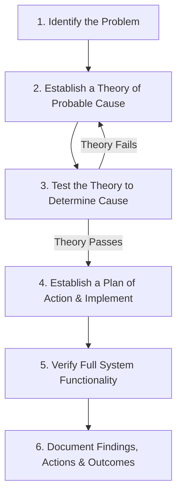

# 08-01 The Professional Troubleshooting Methodology

> [!abstract] Overview
> A guide to the professional troubleshooting methodology. This note details the 6 step troubleshooting process defined by CompTIA A+ and ITIL v4 standards.

---

## 1. What Is It? (Concept Explanation)
Troubleshooting is a systematic process of identifying, analyzing, and resolving issues. Using a structured approach prevents mistakes and reduces resolution times.
*Seedha simple shabdon mein bole toh: PC ya software failure ko solve karte waqt random guesses karne se time waste hota hai. Ek desktop support engineer ko systematically kaam karna hota hai, taaki problem jaldi isolate ho sake aur solutions perfect apply hon.*

---

## 2. Technical Deep-Dive: The 6 Troubleshooting Steps (CompTIA A+)
Follow this methodology for every support ticket to ensure structured and repeatable resolution:



### Step 1: Identify the Problem
Gather information from the user, identify symptoms, and determine if any changes have been made to the system (updates, software, hardware changes).
- **Techniques:** Ask open-ended questions (e.g., "What were you doing when the error appeared?") followed by closed-ended questions. Duplicate the issue if possible. Check Event Viewer logs and diagnostic codes.

### Step 2: Establish a Theory of Probable Cause
Brainstorm potential causes based on the symptoms. Start with the simplest and most obvious possibilities (e.g., loose cables, power switches, network connections) before moving to complex ones.
- **Rule of Thumb:** Occam's Razor. The simplest explanation is usually the correct one.

### Step 3: Test the Theory to Determine the Cause
Run diagnostics or tests to verify your theory.
- **Outcome A (Passed):** If the test confirms your theory, proceed to Step 4.
- **Outcome B (Failed):** If the test fails, establish a new theory (Step 2) and test it. If you lack the permissions or knowledge to test, escalate the issue.

### Step 4: Establish a Plan of Action and Implement the Solution
Create a plan detailing how to resolve the issue. Consider potential impacts and rollback procedures.
- **Risk Mitigation:** If the fix involves registry changes, back up the registry first. If it's a server update, perform it during a maintenance window.
- **Execution:** Implement the fix safely.

### Step 5: Verify Full System Functionality
Verify that the system is fully functional and the problem is resolved.
- **Preventative Measures:** Apply measures to prevent the issue from recurring (e.g., educate the user, enable auto-updates, install anti-virus).

### Step 6: Document Findings, Actions, and Outcomes
Write clear, structured notes in the ticketing system.
- **Benefit:** Populates the Knowledge Base (KCS) and helps other technicians resolve similar issues in the future.

---

## 3. Real-World Support Scenario (STAR Ticket)
- **Situation:** A department report indicates that 15 users in the Accounting team suddenly lost access to their shared network drive (S: Drive) at 10:00 AM, halting invoicing operations.
- **Task:** Systematically diagnose the network drive outage, resolve the root cause, and verify connectivity.
- **Action:**
  1. **Identify the Problem (Step 1):** Interviewed the Accounting supervisor. Confirmed only Accounting users were affected. Checked a user's PC and verified error `0x80070035: The network path was not found`.
  2. **Establish a Theory (Step 2):** Since multiple users are affected, the issue is not local to one PC. The theory is that the department's dedicated switch port crashed, or the file server's network sharing service stopped.
  3. **Test the Theory (Step 3):** Pinged the file server `\\fileserver` from an affected PC (ping failed with timeout). Pings to `google.com` succeeded, indicating the local switch had network access. Checked the file server itself; the physical server was running, but the "Server" (LanmanServer) service had stopped due to a resource leak.
  4. **Establish Plan & Implement (Step 4):** Planned a restart of the Server and Workstation services on the file server during a quick 2-minute emergency window. Restarted services via PowerShell:
     ```powershell
     Restart-Service -Name LanmanServer -Force
     ```
  5. **Verify Functionality (Step 5):** Had three affected users restart their computers. Verified the S: drive successfully mapped and files opened without lag.
  6. **Document (Step 6):** Logged the ticket details (Server service hung, restarted service, restored access, logged incident to server monitoring team for memory leak audit).
- **Result:** Operations restored in under 12 minutes using systematic troubleshooting methodology.

---

## 4. Methodology Matrix Reference Table

| Step | Primary Objective | Key Support Questions / Tools |
|---|---|---|
| **1. Identify** | Locate the root symptom. | "What changed on the device recently?" / Event Viewer |
| **2. Theory** | List potential culprits. | Occam's Razor: simple first (cables, switches). |
| **3. Test** | Validate or discard theory. | Command line diagnostics (`ping`, `nslookup`, `sc query`). |
| **4. Action Plan** | Create and execute solution. | Backup registry / Schedule maintenance window. |
| **5. Verify** | Test system restoration. | User confirmation / System reboot check. |
| **6. Document** | Write resolution log. | Ticketing system notes / KB article generation. |

---

## 5. Frequently Asked Questions (FAQ)

**Q1: Why should I always start with the simplest theory in Step 2?**
A: Starting with simple checks (checking power cables, network connections, or rebooting the PC) saves time. Spending hours auditing registry keys only to find the PC was unplugged is inefficient and costly.

**Q2: What should I do if my theory fails during testing (Step 3)?**
A: Do not force a solution based on a failed theory. Discard it, document that it was tested and ruled out, and brainstorm a new theory based on the results of the test.

**Q3: Why is backing up system configuration files crucial before implementing a plan?**
A: If the planned fix fails, breaks other systems, or corrupts configuration files, having a backup allows you to execute a rollback plan and return the system to its pre-troubleshooting state.

**Q4: How does documenting findings (Step 6) benefit the overall support team?**
A: It creates a knowledge base (KB) repository. If a similar issue occurs later, other technicians can search the tickets or KB and resolve the incident using your documented fix, reducing Average Handling Time (AHT).

---

## Related Notes
- [[08-02 BSOD (Blue Screen of Death) Analysis]] - Troubleshooting Windows crashes
- [[05-08 Documentation & Knowledge Base]] - Ticket documenting guidelines
- [[00-Daily-Log-Template]] - Daily log reporting