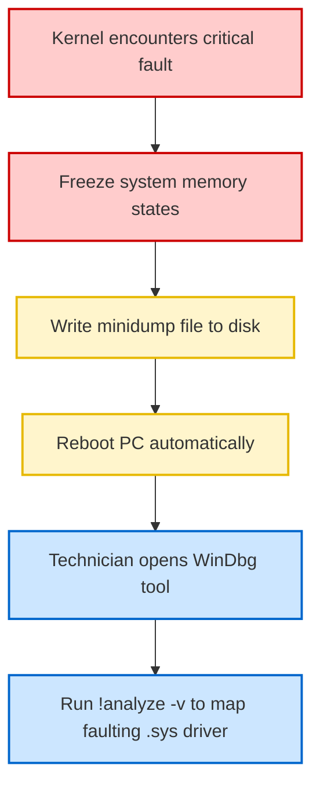

# 08-02 BSOD (Blue Screen of Death) Analysis

> [!abstract] Overview
> A diagnostic manual for Windows Blue Screen of Death (BSOD) crashes. This note covers parsing dump files, standard stop codes, and debugging tools.

---

## 1. What Is It? (Concept Explanation)
A Blue Screen of Death (Stop Error) is a critical operating system crash triggered by kernel failures.



A Blue Screen of Death (BSOD), formally known as a Stop Error, occurs when the Windows kernel encounters a critical error from which it cannot safely recover.
*Seedha simple shabdon mein bole toh: BSOD Windows ka emergency brake hai. Jab koi driver hardware ko corrupt karta hai ya hardware crash hone lagta hai, toh OS safe mode mein crash ho jata hai taaki hard drive files corrupt na ho jayein. Hum crash dumps analyze karke error code aur faulting driver file ka pata lagate hain.*

---

## 2. Technical Deep-Dive: Memory Dumps & WinDbg Parsing
When Windows encounters a Stop error, it writes system memory state data into a dump file before rebooting. These files are located at:
- **Full Memory Dump:** `C:\Windows\MEMORY.DMP` (contains entire RAM contents, large size).
- **Minidumps:** `C:\Windows\Minidump\*.dmp` (smaller files containing processor register states and loaded driver lists).

### Analyzing Dump Files with WinDbg
**WinDbg** is the official Microsoft debugger for analyzing Windows dump files:
1. Open WinDbg as Administrator.
2. Select File > Open Dump File and select the latest `.dmp` file from `C:\Windows\Minidump`.
3. Configure the symbol search path to access Microsoft's server database:
   `srv*C:\Symbols*https://msdl.microsoft.com/download/symbols`
4. Run the automated analysis command:
   ```text
   !analyze -v
   ```
5. Review the output fields:
   - **BUGCHECK_CODE:** The Stop Code.
   - **MODULE_NAME:** The software package that triggered the crash.
   - **IMAGE_NAME:** The exact driver file that failed (e.g., `rtwlane.sys` for Realtek Wi-Fi, `nvlddmkm.sys` for Nvidia GPU).

---

## 3. Real-World Support Scenario (STAR Ticket)
- **Situation:** A design engineer's workstation crashes with a Blue Screen of Death three to four times a day, showing the Stop Code `SYSTEM_THREAD_EXCEPTION_NOT_HANDLED` and faulting module `nvlddmkm.sys`.
- **Task:** Analyze the crash dump files, identify the root cause, and resolve the instability.
- **Action:**
  1. Booted the system and opened `C:\Windows\Minidump` to locate the three most recent dump files.
  2. Installed **BlueScreenView** to perform a quick visual analysis of the minidump files.
  3. Verified all three crashes highlighted `nvlddmkm.sys` (the Nvidia Kernel Mode Driver) and occurred when the user launched CAD rendering software.
  4. Booted the workstation into **Safe Mode** to prevent the corrupted driver from loading during startup.
  5. Downloaded the Display Driver Uninstaller (DDU) utility and ran it to wipe all traces of the Nvidia driver and registry keys.
  6. Restarted the PC in normal mode and installed the latest stable WHQL-certified OEM graphics driver from the manufacturer's website.
  7. Ran a 30-minute GPU stress test using CAD bench tools to verify stability.
- **Result:** The system completed the stress tests without crashing, and the user reported zero BSOD events over the next week.

---

## 4. Critical BSOD Stop Codes Reference

| Stop Code Name | Hex Code | Common Cause | Diagnostic / Resolution Action |
|---|---|---|---|
| **INACCESSIBLE_BOOT_DEVICE** | `0x0000007B` | Storage controller driver issue, loose SATA cable, or corrupted BCD boot files. | Run `bootrec /rebuildbcd` in WinRE / inspect SATA cables. |
| **PAGE_FAULT_IN_NONPAGED_AREA** | `0x00000050` | Corrupted system RAM module or failing hardware driver memory access. | Run `mdsched.exe` (Windows Memory Diagnostic) / swap RAM. |
| **DRIVER_IRQL_NOT_LESS_OR_EQUAL**| `0x0000000A` | Driver attempting to access protected memory addresses it does not own. | Roll back or update the driver highlighted in the dump file. |
| **WHEA_UNCORRECTABLE_ERROR** | `0x00000124` | Hardware failure (overheating CPU, failing power supply, unstable overclock). | Clean dust from CPU fans / check voltages in BIOS / replace PSU. |

---

## 5. Frequently Asked Questions (FAQ)

**Q1: How do I prevent Windows from rebooting automatically after a BSOD so I can read the screen?**
A: Open System Properties (`sysdm.cpl`), go to the **Advanced** tab, click **Settings** under "Startup and Recovery", uncheck the box for **Automatically restart**, and click OK.

**Q2: What is the difference between BlueScreenView and WinDbg?**
A: **BlueScreenView** is a lightweight tool that displays a quick list of loaded drivers and highlights the active failing module. **WinDbg** is an advanced developer tool that parses stack traces and memory structures, allowing deep-dive analysis of complex kernel hangs.

**Q3: How do I run a memory diagnostic test on Windows?**
A: Press `Win + R`, type `mdsched.exe`, select **Restart now and check for problems**. The computer will reboot into a diagnostic screen and test the physical RAM modules for write errors.

**Q4: What does a WHEA_UNCORRECTABLE_ERROR indicate?**
A: This is a Windows Hardware Error Architecture (WHEA) stop code. It indicates a physical hardware failure (typically CPU, Motherboard, or RAM) rather than a software issue. Check system temperatures and hardware seating.

---

## Related Notes
- [[12-05 BSOD Stop Codes Reference]] - Quick stop code index
- [[08-05 Boot Issues Troubleshooting]] - System startup repairs
- [[02-10 System Recovery Tools]] - Offline repairs