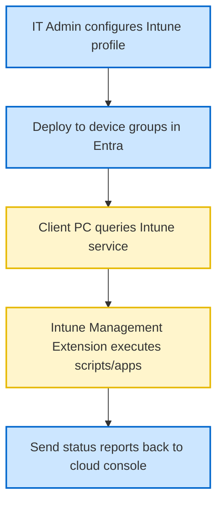

# 10-02 Microsoft Intune Basics

> [!abstract] Overview
> A diagnostic manual for Microsoft Intune cloud management. This note covers MDM enrollment profiles, troubleshooting Intune Management Extension (IME) deployments, and diagnostic sync procedures.

---

## 1. What Is It? (Concept Explanation)
Microsoft Intune is a cloud-based mobile device and application management console.

Microsoft Intune is a cloud-based Enterprise Mobility Management (EMM) service that controls corporate mobile devices, laptops, and applications. It replaces on-premises management infrastructure, allowing IT to manage endpoints over any active internet connection.
*Seedha simple shabdon mein bole toh: Intune ek cloud MDM system hai. Ise use karne ke liye company network ya VPN ki zaroorat nahi padti. Workstation internet se connect hote hi security settings, configurations, aur updates Microsoft cloud se download kar leta hai.*

---

## 2. Technical Deep-Dive: Intune Enrollment & IME Architecture
Managing endpoints with Intune requires understanding how configuration commands execute on client PCs:

### 1. Enrollment States
Workstations enroll into Intune using two primary models:
- **Entra ID Joined:** Modern cloud-only model. The device is owned by the organization and managed entirely via Intune.
- **Hybrid Entra ID Joined:** Combined model. The device is joined to the local Active Directory domain and registered in the Microsoft Entra cloud, receiving policies from both GPOs and Intune.

### 2. The Intune Management Extension (IME)
By default, Windows has a built-in MDM agent. However, this agent can only process basic MDM configurations. To run complex PowerShell scripts and Win32 applications, Intune installs a service called the **Intune Management Extension (IME)**.
- **Diagnostics:** The IME logs its actions in a dedicated text file:
  `C:\ProgramData\Microsoft\IntuneManagementExtension\Logs\IntuneManagementExtension.log`
- Open this log using CMTrace to troubleshoot Win32 application installation blocks and script execution errors.

---

## 3. Real-World Support Scenario (STAR Ticket)
- **Situation:** A remote engineer reports that a critical security tool (Zscaler client) failed to install on their new corporate laptop. They are working from home and cannot connect to VPN.
- **Task:** Verify the device's Intune enrollment status, trace the installation error in Intune logs, and resolve the deployment failure.
- **Action:**
  1. Had the user open **Settings > Accounts > Access Work or School**. Verified the connection showed "Connected to Company Microsoft Entra ID" and clicked **Info**.
  2. Clicked the **Sync** button to force a manual policy sync with the Microsoft cloud.
  3. Checked the Intune console online. The app status showed "Install Failed".
  4. Retrieved the Intune Management Extension log file from the client laptop:
     `C:\ProgramData\Microsoft\IntuneManagementExtension\Logs\IntuneManagementExtension.log`
  5. Opened the log file and searched for the string `[Win32App]`.
  6. Located the installation execution block: the installer command exited with code `1603` (fatal error during installation).
  7. Investigated the 1603 exit code and found it was caused by a pre-existing older version of Zscaler blocking the installer database.
  8. Wrote a quick CMD command to uninstall the old program registry key, ran the clean uninstall, and clicked **Sync** on the Intune Settings menu.
- **Result:** The Intune agent successfully verified the old software was removed, downloaded the new package, and installed Zscaler without further errors.

---

## 4. Intune Diagnostic Tools Reference

| Configuration Location | Path / Console Target | Diagnostic Focus |
|---|---|---|
| **Intune Local Logs** | `C:\ProgramData\Microsoft\IntuneManagementExtension\Logs\` | Debugging Win32 apps and PowerShell scripts. |
| **MDM Registry Keys** | `HKLM\SOFTWARE\Microsoft\Enrollments\` | Checking device enrollment GUIDs and sync paths. |
| **Settings Sync Console** | `Settings > Accounts > Access Work or School` | Triggering immediate policy check-in cycles. |
| **IME Service Status** | `services.msc` > "IntuneManagementExtension" | Restarting the client service to force evaluations. |

---

## 5. Frequently Asked Questions (FAQ)

**Q1: How do I force an immediate policy sync on a Windows 10/11 Intune client?**
A: Open Settings > Accounts > Access Work or School. Select the corporate account, click **Info**, scroll down, and click the **Sync** button. Alternatively, open Services console and restart the **Intune Management Extension** service.

**Q2: What does error code 1603 mean in Intune application logs?**
A: Exit code `1603` is a generic Windows Installer error. It typically indicates permission issues, insufficient disk space, or conflicts with a previous installation of the software. Inspect the application installation log for details.

**Q3: What is the difference between a Configuration Profile and a Compliance Policy?**
A: **Configuration Profiles** are used to configure settings on a device (like setting up Wi-Fi profiles or disabling USB drives). **Compliance Policies** check if a device meets security requirements (e.g. BitLocker must be enabled, firewall must be running) and block access to company resources if it fails.

**Q4: How do I collect diagnostic logs for Intune support?**
A: Open Settings > Accounts > Access work or school > select account > click Info > click **Create Report**. Windows generates diagnostic HTML reports under `C:\Users\Public\Documents\MDMDiagnostics\`.

---

## Related Notes
- [[10-01 SCCM Basics for Desktop Support]] - Configuration manager diagnostics
- [[10-03 Windows Autopilot]] - Device provisioning manual
- [[07-03 Antivirus & Endpoint Security]] - Managing security policies