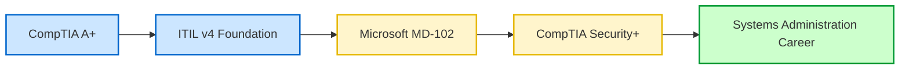
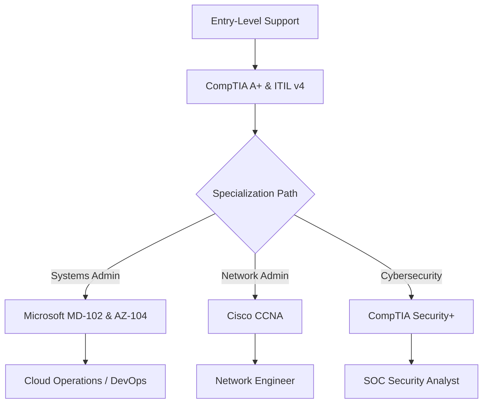

# 11-04 Certifications Roadmap

> [!abstract] Overview
> A strategic study and career roadmap detailing essential IT certifications for Desktop Support professionals. Covers foundational, specialist, and advanced learning paths to transition from Tier 1 Support to Systems Administration.

---

## 1. What Is It? (Concept Explanation)
Certifications provide industry-recognized proof of skills and qualifications.

IT Certifications are third-party credentials that validate your technical skills, knowledge, and competency in specific technologies. For Desktop Support Engineers, certifications provide a structured learning path and are highly valued by corporate recruiters during hiring decisions.
*Seedha simple shabdon mein: Certifications aapke skills ka physical proof hain jo companies ko batate hain ki aapko hardware, OS, networking aur cloud platforms ki basic aur advanced knowledge hai. A+ aur ITIL se career start karein taaki resume verify ho sake, fir Intune (MD-102) ya Networking (CCNA) karke senior roles aur high package secure karein.*

---

## 2. IT Support Certification Roadmap

---

## 3. In-Depth Certification Breakdown

### 1. Foundational Certifications (Tiers 1 & 2 Support)
- **CompTIA A+ (Core 1: 220-1101 & Core 2: 220-1102):**
  - *Domain Focus:* Hardware diagnostics, mobile devices, networking protocols, operating systems (Windows, macOS, Linux), security practices, and operational procedures.
  - *Value:* The industry standard for entry-level IT support. Validates that you can diagnose hardware issues, configure network cards, and support various operating systems.
- **ITIL v4 Foundation:**
  - *Domain Focus:* IT Service Management (ITSM) frameworks, service value chain, lifecycle stages, and standard processes (Incident, Problem, Change, SLA).
  - *Value:* Crucial for understanding how enterprise IT support teams operate inside corporate environments.

### 2. Specialist Certifications (Tier 2 & Systems Support)
- **Microsoft Endpoint Administrator (MD-102):**
  - *Domain Focus:* Deploying Windows client endpoints, managing profiles and compliance, application packaging, and managing updates using Microsoft Intune, Windows Autopilot, and Entra ID.
  - *Value:* The most valuable certification for modern Windows systems support. Bridges desktop support to modern cloud endpoint management.
- **Cisco Certified Network Associate (CCNA 200-301):**
  - *Domain Focus:* IP routing, VLAN configurations, switch management, network security, IP subnetting, and wireless configurations.
  - *Value:* Essential if you want to transition from desktop support to network administration.

---

## 4. study schedule Planner
Use this plan to complete your certifications over a 6-month timeline:

- **Months 1-2: CompTIA A+ Core 1 & 2**
  - *Weekly Focus:* Study processor configurations, RAM speeds, motherboard bus configurations, Windows installation steps, and diagnostic CLI tools.
  - *Action:* Take multiple practice mock tests (score > 85% before registering for the exams).
- **Month 3: ITIL v4 Foundation**
  - *Weekly Focus:* Review service lifecycle stages, Incident vs. Problem definitions, and SLA calculations.
  - *Action:* Complete a 3-day boot camp or self-study using ITIL exam prep guides.
- **Months 4-5: Microsoft MD-102 (Endpoint Administrator)**
  - *Weekly Focus:* Set up a Microsoft 365 developer trial account. Build virtual lab machines, enroll them in Microsoft Intune, and deploy application packages.
  - *Action:* Study Intune configuration profiles and deployment logs.

---

## 5. Study & Interview Q&A
**Q1: How does the ITIL v4 certification benefit a Desktop Support Engineer?**
A: ITIL v4 teaches the language of enterprise IT operations. It explains how support tickets flow from Incidents to Problems, how Changes are reviewed, and how SLA metrics dictate priority. Having this certification shows employers that I can integrate into their existing service desk workflows without needing extensive training on operational processes.

**Q2: What is the career benefit of passing the MD-102 Endpoint Administrator certification?**
A: MD-102 validates my expertise in cloud-based endpoint management. Instead of manually imaging individual PCs, MD-102 teaches me how to orchestrate automated deployments for thousands of devices globally using Microsoft Intune and Windows Autopilot. This moves my career from a localized desktop technician to a global systems administrator.

---

## CompTIA vs ITIL vs Microsoft Credentials Value
When planning your professional IT certifications:

- **CompTIA A+:** The baseline standard for entry-level desktop support, verifying core hardware and OS troubleshooting.
- **ITIL v4 Foundation:** Validates process alignment within corporate service delivery frameworks (Service Value System).
- **Microsoft MD-102 (Endpoint Administrator):** Verifies cloud Intune, Autopilot, and SCCM management skills, preparing you for senior desktop support roles.

### Continuing Education (CEU) Requirements
CompTIA certifications must be renewed every 3 years. Technicians renew them by earning 20 Continuing Education Units (CEUs) through training or passing higher-level exams (Network+, Security+). Microsoft certifications require passing free annual online renewal assessments on Microsoft Learn.

## Related Notes
- [[00-Certification-Tracker]] - Milestone tracker checklist
- [[11-03 Resume Writing for Desktop Support]] - Listing certifications on resumes
- [[05-01 ITIL v4 Foundation for Support Engineers]] - ITIL concepts