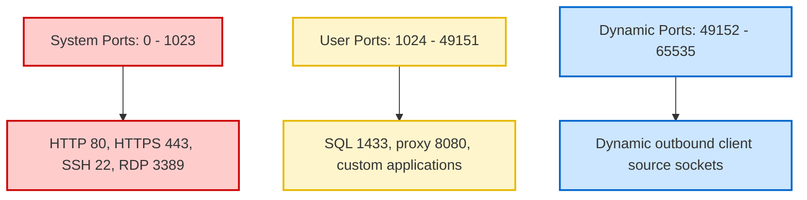

# 12-03 Network Ports Reference Table

> [!abstract] Overview
> An exhaustive, production-grade network ports reference sheet. This guide compiles standard TCP and UDP port allocations, secure equivalents, protocol definitions, and CLI diagnostic procedures to test port listening status.

---

## 1. What Is It? (Concept Explanation)
Network ports act as logical connection sockets for data routing.



In network communications, a port is a logical endpoint mapped to a specific software service running on a computer. While IP addresses route packets to the correct device interface, port numbers direct data to the correct application process. Port numbers range from `0` to `65535` and are categorized by the Internet Assigned Numbers Authority (IANA).
*Seedha simple shabdon mein: Agar IP address kisi high-rise building ka street address hai, toh Port Number building ka office room number hai. Mail post department 25 (SMTP) par jayega, web developer room 443 (HTTPS) par hoga, aur remote administration control room 3389 (RDP) par. IT support mein firewall issues debug karte waqt in port numbers ko yaad rakhna bahut zaroori hota hai.*

---

## 2. Port Categories Overview
Port allocations are divided into three ranges:
1. **Well-Known Ports (`0` - `1023`):** Reserved for system services and standard network protocols (e.g., HTTP, DNS, DHCP).
2. **Registered Ports (`1024` - `49151`):** Assigned by IANA for specific vendor software and database systems (e.g., RDP, MS SQL).
3. **Dynamic / Private Ports (`49152` - `65535`):** Temporary ports dynamically opened by client operating systems to send outbound data.

---

## 3. Core Enterprise Network Ports Reference Table
This table lists essential ports utilized in corporate client-server environments:

| Port Number | Protocol Type | Service Name | Protocol Definition & Description | Secure Equivalent |
|---|---|---|---|---|
| **20 / 21** | TCP | FTP | File Transfer Protocol. Used for raw file sharing. Unencrypted. | SFTP (Port 22) / FTPS (Port 990) |
| **22** | TCP | SSH / SFTP | Secure Shell. Provides encrypted remote terminal CLI access and secure file transfer. | Native |
| **23** | TCP | Telnet | Unencrypted remote command line terminal access. Disabled by policy. | SSH (Port 22) |
| **25** | TCP | SMTP | Simple Mail Transfer Protocol. Used to send mail payloads between servers. | SMTPS (Port 465 / 587) |
| **53** | TCP/UDP | DNS | Domain Name System. Translates domain hostnames to IP addresses. | DoT (Port 853) |
| **67 / 68** | UDP | DHCP | Dynamic Host Configuration Protocol. Auto-assigns IP configurations. | N/A |
| **80** | TCP | HTTP | Hypertext Transfer Protocol. Plaintext web page traffic. | HTTPS (Port 443) |
| **88** | TCP/UDP | Kerberos | Kerberos Authentication Protocol. Core service for AD user logons. | Native |
| **110** | TCP | POP3 | Post Office Protocol v3. Downloads mail locally from servers. | POP3S (Port 995) |
| **123** | UDP | NTP | Network Time Protocol. Synchronizes clock times across computers. | Secure NTP (Port 123) |
| **137-139** | TCP/UDP | NetBIOS | NetBIOS Name Service. Used for legacy name resolution over LANs. | DNS (Port 53) |
| **143** | TCP | IMAP | Internet Message Access Protocol. Synchronizes mailboxes across devices. | IMAPS (Port 993) |
| **161 / 162** | UDP | SNMP | Simple Network Management Protocol. Monitors device status. | SNMPv3 |
| **389** | TCP/UDP | LDAP | Lightweight Directory Access Protocol. Active Directory queries. | LDAPS (Port 636) |
| **443** | TCP | HTTPS | Hypertext Transfer Protocol Secure. Encrypted web traffic using TLS/SSL. | Native |
| **445** | TCP | SMB | Server Message Block. Accesses shared network drives and printers. | Native |
| **636** | TCP | LDAPS | Lightweight Directory Access Protocol Secure. Encrypted AD queries. | Native |
| **1433** | TCP | MS SQL | Microsoft SQL Server database database connections. | Encrypted Tunnel |
| **3389** | TCP | RDP | Remote Desktop Protocol. Used to connect to Windows remote screens. | Native |

---

## 4. Diagnostics CLI SOP: Checking Network Ports
Use these procedures to diagnose open or blocked ports during network troubleshooting:

### 1. Check Listening Ports on Local Client
Open Command Prompt and check for active ports and their listening state:
```cmd
:: List all active TCP/UDP ports and their Process IDs (PID)
netstat -ano | findstr LISTENING
```
Verify which process is holding port `3389` (RDP):
```cmd
netstat -ano | findstr :3389
```

### 2. Verify Remote Port Status (PowerShell)
From the client workstation, test if the corporate secure LDAP database server is responding on port 636:
```powershell
Test-NetConnection -ComputerName dc01.corp.local -Port 636
```
**Expected Successful Output:**
```text
ComputerName     : dc01.corp.local
RemoteAddress    : 10.10.1.10
RemotePort       : 636
InterfaceAlias   : Ethernet 0
SourceAddress    : 10.10.1.150
TcpTestSucceeded : True
```

---

## 5. Study & Interview Q&A
**Q1: What is the security difference between Port 22 and Port 23?**
A: Port 22 runs SSH (Secure Shell), which encrypts all session traffic, including passwords and commands. Port 23 runs Telnet, which transmits data in clear, unencrypted plaintext. Anyone intercepting network traffic on a Telnet connection can capture credentials.

**Q2: A user cannot access a shared network drive (\\fileserver\share). Which network port should you check?**
A: I would check Port 445, which handles SMB (Server Message Block) traffic, the protocol used for sharing files and folders in Windows environments. If Port 445 is blocked by a network firewall or local Defender rules, file sharing will fail.

**Q3: What ports are utilized during a corporate user login session in Active Directory?**
A: Several ports are critical for AD login authentication: Port 88 for Kerberos ticket assignment, Port 53 for DNS to locate the Domain Controller, Port 389/636 for LDAP/LDAPS queries to read user directory properties, and Port 445 for SMB to pull Group Policies from the DC SYSVOL share.

---

## Related Notes
- [[03-04 Network Ports Master Reference]] - Deep-dive protocol listings
- [[03-08 Network Diagnostic Commands]] - Network diagnostic console queries
- [[12-02 CMD & PowerShell Commands Cheat Sheet]] - Administrative scripts