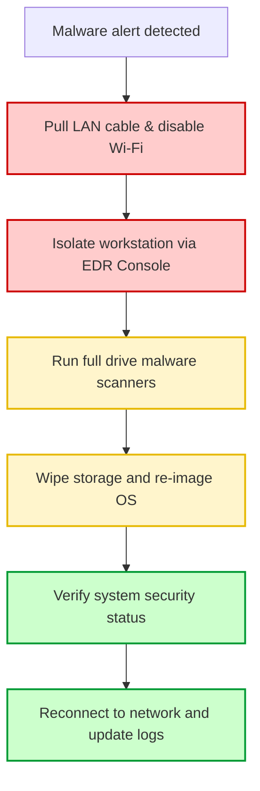

# 13-05 Malware Incident Response SOP

> [!abstract] Overview
> Standard Operating Procedure (SOP) for containing malware outbreaks and responding to cyber incidents on user endpoints. Covers physical containment, device isolation, scanning, system audits, and incident reporting.

---

## 1. What Is It? (Concept Explanation)
Malware incident response outlines containment, cleaning, and recovery protocols.



Malware incident response is the technical procedure used to isolate, analyze, and remove malicious software (viruses, trojans, ransomware, spyware) from a compromised endpoint, preventing it from spreading across the corporate network.
*Seedha simple shabdon mein: Jab kisi user ka laptop virus ya ransomware se corrupt ho jata hai, toh IT support team ka pehla kaam device ko network se cut karna hota hai taaki virus dusre computers par na faile. Iske baad backup scan run karte hain, security logs check karte hain, aur system ko sanitize karke restore ya reinstall karte hain.*

---

## 2. Malware Containment Workflow
Execute these critical actions immediately upon receiving a malware alert:

- [ ] **Isolate the Host System (Containment):**
  1. Immediately pull out the physical Ethernet network cable.
  2. Turn off Wi-Fi on the laptop. (Do not shut down the PC immediately, as key forensic logs in active memory may be lost).
- [ ] **Isolate Device via Console (EDR/Intune):**
  1. Log on to the enterprise EDR console (e.g., Microsoft Defender for Endpoint, CrowdStrike).
  2. Search for the hostname. Select **Isolate Device**. This blocks all network traffic except the security console link.
- [ ] **Run Advanced Malware Scans:**
  1. Open Windows Security or the local EDR client.
  2. Run a **Full System Scan** or initiate a **Windows Defender Offline Scan** (reboots and scans the system files before the OS kernel boots).
- [ ] **Audit Registry & Startup Locations:**
  1. Open Registry Editor (`regedit.exe`) and check for malicious startup keys:
     - `HKLM\SOFTWARE\Microsoft\Windows\CurrentVersion\Run`
     - `HKCU\Software\Microsoft\Windows\CurrentVersion\Run`
  2. Open Task Manager and check the Startup tab for unrecognized processes.
- [ ] **System Sanitation & Restoration:**
  - If malware is isolated and removed, run system repair tools (`sfc /scannow`).
  - If ransomware or deep system infection is found, perform a secure wipe of the storage drive and clean install the corporate image.

---

## 3. Real-World Incident Tickets

### Ticket 1: Ransomware Alert on Local Department Shared Folder
- **Incident ID:** INC110499
- **Priority:** P1 (Security Outage)
- **Problem Statement:** "Files in our local department share folder are suddenly changing their extensions to `.locked` and we cannot open any spreadsheets."
- **Diagnostics:**
  1. Identified that a ransomware encryption script was running on the file server.
  2. Checked active session connections on the file server. Located the client machine sending massive file modifications: `LAP-SALES-52`.
  3. Remotely isolated `LAP-SALES-52` from the network switch console.
- **Resolution:** Isolated the infected laptop, halting the encryption loop. Restored the shared folders on the file server from last night's backup. Wiped the infected laptop drive and rebuilt it.

### Ticket 2: Rogue Browser Extension Redirecting Intranet Traffic
- **Incident ID:** INC110512
- **Priority:** P3
- **Problem Statement:** "Every time I search for google.com, my browser redirects to a search page filled with advertisements."
- **Diagnostics:**
  1. Ran a malware scan using Defender (no threats found).
  2. Checked browser settings. Opened Chrome extension panel: `chrome://extensions`.
  3. Found an extension named "PDF Online Converter" installed from a non-store package.
  4. Traced its folder in local AppData and found scripts modifying DNS redirects.
- **Resolution:** Removed the extension, deleted its folder from `%localappdata%\Google\Chrome\User Data\Default\Extensions`, reset the browser settings to default, and verified Google opened successfully.

---

## 4. Technical File Auditing Commands
Inspect active network connections and running processes using CMD:
```cmd
:: List active network connections and the program PID using bandwidth
netstat -ano | findstr ESTABLISHED

:: Force close a suspected rogue process
taskkill /f /pid <Rogue_PID>
```

---

## 5. Common Mistakes & Best Practices
- **Rebooting Immediately:** Do not reboot a compromised PC immediately if you suspect a sophisticated attack. Rebooting can delete volatile memory (RAM) logs that security teams need to trace the malware source.
- **Plugging in Backup USBs:** Never plug in backup USB drives to a system that is actively infected with malware, as the virus can copy itself to the external drive, spreading the infection.

---

## 6. Pro Tips (Senior Engineer Secrets)
> [!tip] Defender Offline Scan
> If malware keeps re-infecting a system after deletion, run:
> `Start-MpWDOScan` in PowerShell.
> This triggers the Windows Defender Offline engine. It will reboot the system into a secure Linux-like container to scan and delete malware before the normal Windows drivers load, bypassing registry blocks.

---

## 7. Interview Q&A Bank
**Q1: What is the very first action you take when a user reports their screen displays a ransomware notice?**
A: My absolute first action is to physically isolate the computer from the network. I instruct the user to unplug their Ethernet cable and turn off their Wi-Fi adapter immediately. This stops the ransomware encryption from spreading to other network drives and servers.

**Q2: What is the difference between a normal antivirus scan and a boot-time scan?**
A: A normal scan runs inside the active Windows OS user mode, where running malware can hide in memory or use registry tricks to block detection. A boot-time scan (like Defender Offline) runs before Windows loads, allowing the scanner to access the storage drive directly and remove malware files that are locked during normal operation.

**Q3: How do you identify if a suspicious background process is malware using native tools?**
A: I open Task Manager and navigate to the Details tab. I check the process name, right-click, and select **Open File Location** to check if it resides in temp folders like `%temp%` or `AppData`. I also check the digital signature properties of the executable file to verify if it is signed by a trusted publisher.

---

## Related Notes
- [[07-02 Malware Types & Response]] - Malware categories details
- [[07-03 Antivirus & Endpoint Security]] - EDR client setups
- [[07-08 Security Incident Response]] - Incident handling protocols