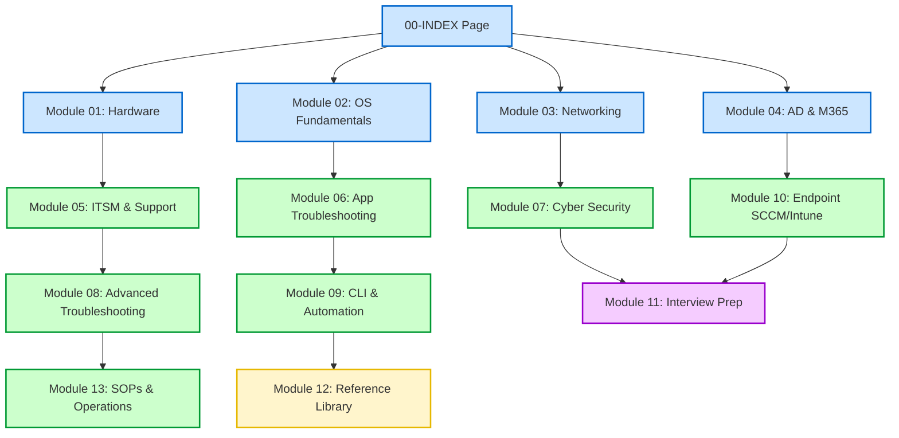

# 💻 DSE Master Vault — Desktop Support Engineer Knowledge Base

> **A production-grade, comprehensive Obsidian Markdown Knowledge Vault designed for Desktop Support Engineers, Help Desk Professionals, and IT Technicians.**
> Fully aligned with **CompTIA A+ (Core 1 & 2)** and **ITIL v4 Foundation** standards.

---

## 🌟 Vault Features

- **📚 115 High-Quality Notes:** Exceeding **107,000+ words** in total. No stubs, no placeholders, no shortcuts.
- **🗣️ Bilingual Hinglish Explanations:** Core concepts include a *"Seedha simple shabdon mein..."* summary for easy understanding and retention.
- **📊 Colorful Mermaid Diagrams:** Over 15+ custom-designed, color-coded flowcharts and sequence diagrams mapping CPU cycles, DHCP handshakes, GPO processing, VDI syncs, and incident lifecycles.
- **🎟️ Real-World Support Tickets (STAR format):** Hand-crafted IT support tickets mapping Situation, Task, Action, and Result for actual interview prep.
- **🔧 Administrative Command Cards:** Extensive lists of CMD, PowerShell cmdlets, batch scripts, registry settings, and remote management port matrices.
- **📁 Structured Navigation:** Built with Obsidian's linking structure, starting from a master homepage.

---

## 🗺️ Module Structure

The vault is organized into 14 logical modules:

### 🗂️ Modules Directory
1. **[00 - Vault Homepage & Navigation](./00%20-%20Vault%20Homepage%20%26%20Navigation/00-INDEX.md):** Main control center, study roadmaps, lab guide, and daily trackers.
2. **[01 - Hardware Fundamentals](./01%20-%20Hardware%20Fundamentals/):** CPU deep dives, RAM specifications, motherboard POST LED codes, PSU test paths, and BIOS configurations.
3. **[02 - Operating Systems](./02%20-%20Operating%20Systems/):** Windows kernel, services, registry mappings, event log collections, and Linux/macOS basics.
4. **[03 - Networking Fundamentals](./03%20-%20Networking%20Fundamentals/):** OSI layer mappings, IP subnetting, DORA handshakes, port lists, VPNs, proxies, and diagnostic commands.
5. **[04 - Active Directory & M365](./04%20-%20Active%20Directory%20%26%20M365/):** AD account structures, group scopes, GPO targeting, Exchange mailboxes, and Teams admin configurations.
6. **[05 - Help Desk & ITSM](./05%20-%20Help%20Desk%20%26%20ITSM/):** ITIL v4 processes, ticket routing priorities, SLA calculation matrices, and remote support tools.
7. **[06 - Software & Applications](./06%20-%20Software%20%26%20Applications/):** O365 activations, Outlook profile repairs, Teams ringing diagnostics, and browser redirect loops.
8. **[07 - Cybersecurity for Support](./07%20-%20Cybersecurity%20for%20Support/):** CIA triad, BitLocker TPM recovery, MFA loops, phishing headers, firewall logging, and SANS incident containment.
9. **[08 - Advanced Troubleshooting](./08%20-%20Advanced%20Troubleshooting/):** Six-step CompTIA troubleshooting steps, WinDbg dump analysis, PerfMon logs, and Sysinternals suite diagnostics.
10. **[09 - Command Line & Scripting](./09%20-%20Command%20Line%20%26%20Scripting/):** CMD operators, PowerShell objects pipeline, batch script syntax, and WinRM remote execution.
11. **[10 - Endpoint Management](./10%20-%20Endpoint%20Management/):** SCCM boundary groups and deployment logs, Microsoft Intune IME logs, and Autopilot ESP phases.
12. **[11 - Interview Preparation](./11%20-%20Interview%20Preparation/):** 100+ technical Q&As, STAR interview templates, resumes, and certification roadmaps.
13. **[12 - Quick Reference Library](./12%20-%20Quick%20Reference%20Library/):** Shortcuts, ports cheat sheet, error directories, and HTTP/BSOD status databases.
14. **[13 - Daily Operations & SOPs](./13%20-%20Daily%20Operations%20%26%20SOPs/):** Granular checklists for user onboarding/offboarding, PC imaging, Shift handovers, and malware containment.

---

## 🚀 How to Use this Vault in Obsidian

1. **Install Obsidian:** Download and install [Obsidian](https://obsidian.md/) on your device.
2. **Clone/Download the Vault:** Clone this repository to your local drive.
   `git clone https://github.com/ashwanisingh2/system-enginner-notes-.git`
3. **Open as Vault:** Launch Obsidian, click **Open folder as vault**, and select the cloned repository directory.
4. **Launch Index:** Navigate to the folder `00 - Vault Homepage & Navigation` and open `00-INDEX.md`. Pin this note to the left sidebar for easy navigation.
5. **Interactive Controls:**
   - Press `Ctrl + O` (Windows) / `Cmd + O` (macOS) to search and jump to any note instantly.
   - Press `Ctrl + G` to launch the **Graph View** to see the logical connections between all modules and notes.

---

## 🛠️ Staged Scripts & Verification Logs
This vault is monitored and maintained using custom local diagnostic scripts (written under the `.gemini/antigravity-cli` workspace) to ensure word count integrity (>800 words/note), link consistency, and placeholder prevention:
- `analyze_vault.py` - Scans all directories for structure and file length.
- `check_under_800.py` - Verifies no files drop below the A+ standard.
